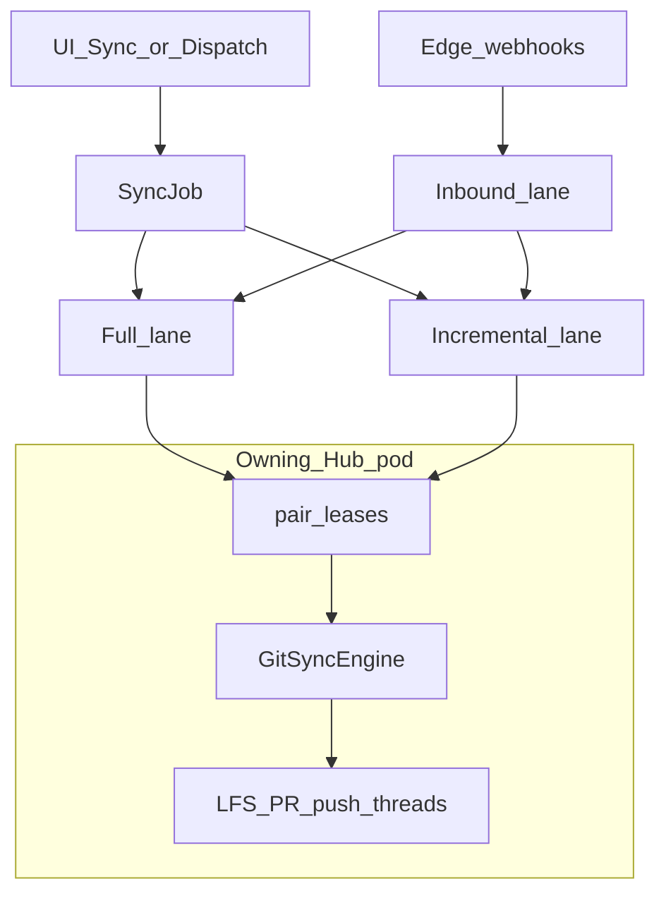
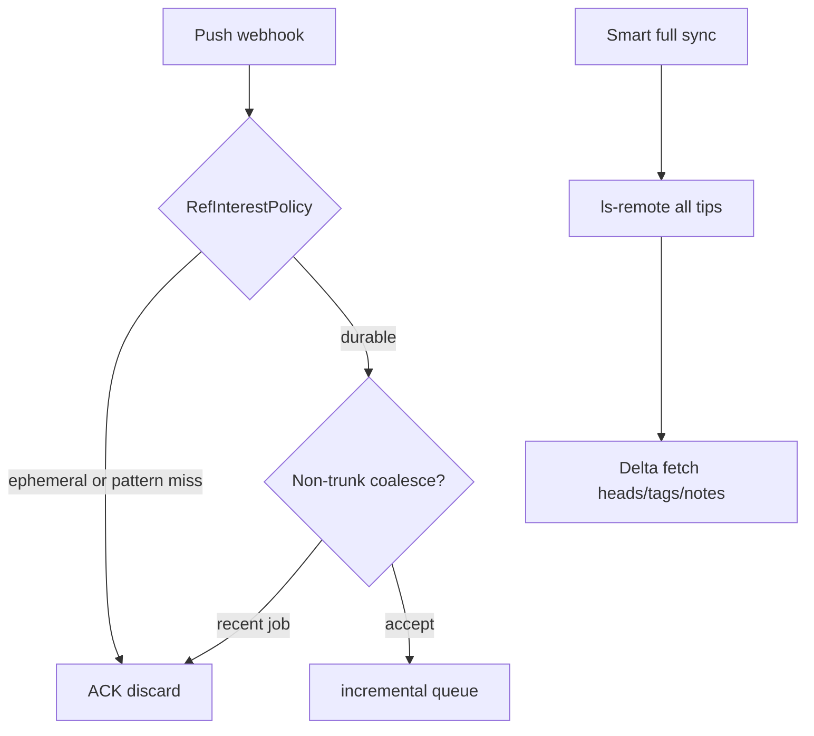

# GitMirror Hub - Architecture & Design Specification

> **Status:** Living Master Architectural Document  
> **Target Audience:** Engineering, DevOps, Platform Architects  
> **Scope:** Bidirectional Git Object Mirroring, Edge Serverless Webhook Ingestion (Cloudflare Workers), SCM Provider Integration, AMQP Event Orchestration, Loop Prevention, and CI/CD Disaster Recovery.

---

## 1. System Vision & Core Design Principles

**GitMirror Hub** is a platform-grade synchronization utility designed to provide real-time, bidirectional mirroring between primary and secondary Git repositories (GitHub to GitHub or GitHub to external Git SCMs like GitLab and Bitbucket).

### Architectural Tenets
1. **Edge-Decoupled Ingestion & 0ms Cold Start**: Ingestion of webhook events from SCMs is handled by a globally distributed serverless gateway (Cloudflare Worker) that validates HMAC signatures and writes to durable AMQP message queues in <15ms.
2. **Zero Data Loss & Event Durability**: Ingestion is decoupled from sync execution via durable AMQP queues with automatic retry backoff and Dead Letter Queue (DLQ) routing.
3. **Loop & Echo Immunity**: Distributed deduplication filters prevent automated push events from triggering recursive mirroring storms across bidirectional repo pairs.
4. **CI/CD Disaster Recovery Readiness**: In addition to Git commit trees and tags, the system mirrors PR refs (`refs/pull/*`), review decisions, and CI status checks so CI/CD pipelines can fail over without re-running long build matrices.
5. **Agentic Churn Tolerance**: Short-lived agent/CI branches (`agents/…`, bots) must not exhaust the incremental webhook lane. Live auto-sync prioritizes durable refs (trunks, releases, pair `branchPattern`); Smart full sync tip-probes remaining churn for DR completeness. See §3.7.
6. **Envelope Encryption & Secret Security**: Repository tokens and secrets are encrypted at rest using AES-256-GCM via `CryptoService` and JPA converter attributes.
7. **Scale out by pairs, not by sharded Git jobs**: Fleet replicas run **many mappings in parallel**. A long **Sync Repo** / `GitSyncEngine.executeSync` stays on **one Hub pod** (in-JVM LFS/PR threads). See §3.6.1.


---

## 2. End-to-End System Architecture

```mermaid
flowchart TD
    subgraph SCM_Providers [SCM Providers: GitHub / GitLab / Bitbucket]
        PrimaryGit[Git Push Events]
        PrimaryPR[Pull Requests & Reviews]
        PrimaryCI[CI Commit Statuses]
    end

    subgraph Edge_Gateway [Edge Webhook Gateway: Cloudflare Workers]
        CFWorker["Cloudflare Worker (src/index.ts)\n- 0ms Cold-Start\n- WebCrypto HMAC Verification\n- RabbitMQ Management API (HTTPS)"]
    end

    subgraph Messaging_Infrastructure [AMQP Messaging Broker (CloudAMQP / RabbitMQ)]
        MainExchange["Exchange: git.sync.exchange"]
        InboundQueue["Queue: git.sync.inbound.queue (Routing: git.webhook.inbound)"]
        IncrementalQueue["Queue: git.sync.incremental.queue (Routing: git.sync.incremental.key)"]
        MainSyncQueue["Queue: git.sync.queue (Routing: git.sync.key)"]
        DLXExchange["Exchange: git.sync.dlx"]
        DLQueue["Queue: git.sync.dlq (Routing: git.sync.dlq.key)"]
        RedriveEngine["DLQ Redrive Replay Engine"]
    end

    subgraph SpringBootBackend [Spring Boot Backend Core]
        subgraph Ingestion_Layer [Ingestion & Webhook Layer]
            InboundConsumer["InboundWebhookConsumerService (@RabbitListener)"]
            DirectWebhookCtrl["WebhookController (/api/v1/webhooks)"]
            WebhookIngestion["WebhookIngestionService"]
            DedupLedger["Loop & Echo Dedup Ledger Service"]
            SimInterceptor["Fault Injection & Simulation Engine"]
        end

        subgraph Core_Services [Core Services & Engines]
            GitSyncEngine["JGit Mirror Engine (+ refs/pull/* Refspecs)"]
            QueueProducer["QueueProducerService"]
            QueueConsumer["QueueConsumerService (full + incremental listeners)"]
            GitHubAuth["GitHubAuthService & Provider Manager"]
            Crypto["CryptoService (AES-256-GCM)"]
        end

        subgraph Persistence_Ledgers [Persistence Layer]
            DB[("H2 / PostgreSQL Database")]
            AuditLogStore[("Audit Logs & Execution Traces")]
        end
    end

    subgraph SCM_Backup [Backup / Secondary SCM]
        BackupGit["Mirrored Bare Git + refs/pull/*"]
    end

    subgraph ReactFrontend [React Frontend Dashboard]
        DashboardView["Repository & Pair Management"]
        ObservabilityView["Live Sync Stream & Metrics"]
        QueueManager["Queue Manager: job history, cancel, purge, DLQ redrive"]
        SimulationLab["Chaos & Outage Simulation Lab"]
        ProviderSettings["SCM Provider & Secret Config"]
        LogViewer["Line-by-Line Audit Log Drawer"]
    end

    PrimaryGit -->|"POST /webhook/github (HMAC)"| CFWorker
    CFWorker -->|"HTTPS REST Publish (<15ms)"| MainExchange
    MainExchange --> InboundQueue

    PrimaryGit -.->|"Fallback direct webhook"| DirectWebhookCtrl
    DirectWebhookCtrl --> WebhookIngestion

    InboundQueue --> InboundConsumer
    InboundConsumer --> WebhookIngestion
    WebhookIngestion --> DedupLedger
    DedupLedger -->|Echo Detected: Skip| DB
    DedupLedger -->|Valid Push Event| QueueProducer
    QueueProducer -->|specific ref| IncrementalQueue
    QueueProducer -->|null or wildcard ref| MainSyncQueue
    MainExchange --> IncrementalQueue
    MainExchange --> MainSyncQueue

    IncrementalQueue --> QueueConsumer
    MainSyncQueue --> QueueConsumer
    QueueConsumer --> SimInterceptor
    SimInterceptor --> GitSyncEngine
    GitSyncEngine -->|Push Branches, Tags, PR Refs| BackupGit
    GitSyncEngine --> DB
    GitSyncEngine --> AuditLogStore

    IncrementalQueue -.->|On 3x Failure Exceeded| DLXExchange
    MainSyncQueue -.->|On 3x Failure Exceeded| DLXExchange
    DLXExchange --> DLQueue
    DLQueue --> RedriveEngine
    RedriveEngine -->|Replay Messages| MainExchange

    AuditLogStore -.->|WebSocket /topic/sync-events| ReactFrontend
    ReactFrontend <-->|REST API /api/v1/*| SpringBootBackend
```

---

## 3. Git Core Mirroring Subsystem

The Git mirroring core is implemented in pure Java via the **Eclipse JGit** engine, eliminating any host OS `git` CLI dependency.

### 3.1 Local Bare Cache Architecture
* The backend maintains persistent bare Git repositories under the configured workspace directory (e.g., `/tmp/git-utility-mirrors/pair-{mappingId}.git`).
* Remote endpoints are structured as:
  * `remote "source"`: Inbound origin repository.
  * `remote "target"`: Outbound mirror destination repository.

### 3.2 Refspecs & Precision Mirroring
The synchronization engine syncs full ref trees using explicit Git refspecs:
* **Branches**: `+refs/heads/*:refs/heads/*` (mirrors all branch heads with fast-forward/force updates).
* **Tags & Annotations**: `+refs/tags/*:refs/tags/*` (mirrors all release and annotated tags).
* **PR Head & Merge Refs**: `+refs/pull/*:refs/pull/*` (mirrors all GitHub PR head snapshots and pre-merge snapshots).
* **Git Notes**: `+refs/notes/*:refs/notes/*` (mirrors provenance and scan metadata).

### 3.3 Conflict Isolation (Split-Brain Divergence Protection)
In bidirectional setups, simultaneous commits to trunk branches (`main`, `master`, `release/*`) could create split-brain divergences.
* **Fast-Forward Detection**: JGit's `RevWalk.isMergedInto()` verifies whether the destination remote head is an ancestor of the incoming commit. The same check runs on **incremental webhook jobs and full-mirror (`*`)** pushes — a remirror never force-overwrites a diverged trunk.
* **Pair policy (`trunkConflictPolicy`)** on each mapping:
  * `ISOLATE` (default): keep the destination tip; push incoming commits to `refs/heads/sync-conflict/<branch>-<timestamp>` and auto-open a conflict PR (`isolated → trunk`) on the destination.
  * `FAIL_JOB`: record the conflict and skip pushing that trunk (other refs still proceed).
  * `ORIGIN_WINS`: force-push source onto destination (designated primary → replica / DR pairs). Operators can still force a one-shot overwrite via `overwriteFromSource`.
* **Published tags**: if a tag name already exists on the destination at a different SHA, the engine skips the force-move and records a `TAG` conflict.
* **Conflict ledger**: `sync_conflicts` persists open Git-ref, tag, and PR-metadata conflicts for the pair UI (acknowledge / retry open PR). Isolated `sync-conflict/*` heads are never reverse-synced or pruned.
* **PR metadata CAS**: origin-side `edited` webhooks PATCH the replica only when the replica title/body still match `lastPushedTitle`/`lastPushedBody`. A CAS miss records a `METADATA` conflict and does not clobber replica edits.
* **Observability**: Job status is recorded as `CONFLICT_ISOLATED` with a detailed audit log trace and amber UI indicator.

### 3.4 Comprehensive Metadata Synchronization Subsystems
* **Git LFS Binary Streaming**: `GitLfsSyncService` scans commit trees for `.gitattributes` and LFS pointers (`version https://git-lfs.github.com/spec/v1`), invoking the Git LFS Batch API (`/info/lfs/objects/batch`) to stream missing binary blobs directly from source to destination. Discovery walks run in parallel (`git-utility.git.lfs-discovery-threads`, default 4); transfers use a bounded worker pool (`git-utility.git.lfs-transfer-concurrency`, default 4) with batch size `git-utility.git.lfs-batch-size` (default 50). Completed OIDs persist on `repo_mappings.completed_lfs_oids` so resume skips already-transferred blobs.
* **Pull Requests & Code Reviews**: `PullRequestSyncService` runs on **full-mirror** jobs (`*`) and the dedicated Sync PRs action. Incremental branch jobs (webhook, Sync main, overwrite) do not bulk-replicate PRs. Real-time PR webhooks still create/update/close mapped same-repo PRs (ephemeral agent heads skipped per §3.7). Fork PRs **cache tip objects** for DR (`state=objects_cached`, optional hidden `refs/gitmirror/fork-pr/{n}`) and do **not** create dest `fork-pr-*` branches or GitHub PRs until `POST …/materialize-fork`. Open PR listing uses GitHub GraphQL when enabled. `RefOriginService` prevents reverse-sync of synthetic and bot heads.
* **Releases & Binary Assets**: `ReleaseAndStatusSyncService` replicates GitHub Releases on full-mirror jobs and the dedicated Sync Releases action, not on single-branch Git jobs.
* **CI Commit Statuses**: Replicates commit statuses (`POST /repos/{owner}/{repo}/statuses/{sha}`) across mirrors.

### 3.5 Enterprise Storage Tiering & Scalability Architecture
To support **20,000+ repositories** without unbounded host disk consumption:
* **No Working Trees**: Bare repositories (`--bare`) store only compressed Git object packs (`.pack` and `.idx`) shared between source and destination, reducing disk footprint to ~10-25% of working tree size.
* **4 Storage Tiers**:
  1. `HOT_PERSISTENT`: High-priority tier-1 repositories permanently cached on local NVMe disk. Never evicted. Sub-200ms syncs.
  2. `AUTO_LRU` (Default): Working repositories cached locally; when disk quota (e.g. 50GB) is reached, cold repositories are automatically pruned based on least-recently-used access.
  3. `EPHEMERAL_STREAM`: Cold or infrequent repositories. Synced inside a temporary directory and immediately destroyed upon completion (0 long-term disk consumption).
  4. `NAS_MOUNT`: Stored directly on a mounted Network-Attached Storage (NFS / EFS / NAS volume, e.g. `/mnt/nas/git-mirrors/`), offloading host disk while preserving shared cache across multiple backend nodes.
* **Automated Housekeeping**: Scheduled and post-sync `git gc` runs pack consolidation and pruning of unreferenced loose objects.

### 3.6 Fast-Path Commit Reachability & Rate-Limiting Shield
* **DAG Ancestry Fast-Path**: Before issuing remote network calls, JGit evaluates `RevWalk.isMergedInto(eventCommit, targetTip)`. If the commit is already present in the bare cache and merged into the branch tip (common during backlog drain after backend restarts), the job short-circuits in **<2ms with 0 remote network calls**.
* **Token-Bucket Concurrency Throttle**: Restricts simultaneous Git push operations (`git-utility.throttle.max-concurrent-git-pushes: 5`) and throttles secondary metadata API polling (minimum 30s window per pair) to eliminate GitHub API 429 rate-limit exhaustion.
* **Circuit Breaker Auto-Pause**: On sustained downstream outages (e.g. 5 consecutive errors), the AMQP consumer auto-pauses, preserving all unprocessed messages safely in RabbitMQ without dropping them.
* **Operator queue control**: Each execution lane (`git.sync.queue` full mirrors, `git.sync.incremental.queue` webhook syncs) has concurrency 1. Different pairs can run a full clone and a webhook incremental sync at the same time; the same pair still serializes on a shared `repoLocks` entry **plus a DB `pair_leases` row** so multi-pod replicas cannot double-write the same mapping. Operators cancel queued jobs (skipped on pickup and ACK'd, never DLQ'd), abort an in-flight run via JGit `ProgressMonitor.isCancelled()` without interrupting the AMQP listener thread, or purge the waiting AMQP buffer from `/queues`.
* **Ready vs Unacked**: RabbitMQ **Ready** is pending (not yet delivered). **Unacked** is the in-flight message a consumer thread holds (`prefetch: 1`). `sync_jobs` remains the history ledger. Do not move in-flight work to a second processing queue — that adds ACK hops without clearer counts. Observability shows per-lane Ready/Unacked, current job, and listener thread health (idle / unused / dead).
* **Multi-pod cluster**: Multiple Hub replicas compete on the same Rabbit queues. Shared Postgres holds `pair_leases`, `cluster_runtime` (fleet pause / CB desired state), and `instance_heartbeats` (Micrometer snapshots including JVM threads and install-scoped REST usage for Observability / Internals). Prefer `NAS_MOUNT` for bare repos across nodes. Soft shard affinity remains future work ([`future-work/cache-resume-worker-affinity.md`](future-work/cache-resume-worker-affinity.md)). Throughput model: **§3.6.1**.

#### 3.6.1 Enterprise throughput & scale model

**Throughput is “many pairs × many pods,” not “one Sync Repo × many pods.”** The Hub is a mirror relay. Hard ceilings are SCM rate limits, pack transfer, and disk — not spreading one JGit job across the fleet.

**Triggers vs execution**

| Path | What it is | Where Git runs |
| :--- | :--- | :--- |
| **Sync Repo / Dispatch / resume** | Operator **UI** (`POST /mappings/{id}/sync`, Queue Manager dispatch). Creates a `SyncJob`. | Entire `executeSync` on **one** worker pod (`workerInstanceId`). API pod that took HTTP may differ if the job is queued. |
| **Webhooks** | Event-driven. Cloudflare Worker → inbound queue → execution lane. | Same: one pod per job after mapping resolve. |
| **Rabbit (today) / Kafka (future)** | Async **events and drain**, not the product meaning of Sync Repo. Future broker sketch: [`future-work/kafka-mirroring-partitions.md`](future-work/kafka-mirroring-partitions.md). | Does not shard Git for one mapping. |



**Layered scale (authoritative)**

| Layer | How you get scale | What you do not do | Why |
| :--- | :--- | :--- | :--- |
| **Fleet / pairs** | More Hub replicas; competing consumers on full / incremental / inbound; `pair_leases` | Two pods Git-writing the same `mappingId` | One `pair-{id}.git` + dest remotes + push ledgers |
| **Stickiness** | Prefer the worker that already has the bare repo; NAS for hydrate on failover | Random cold re-clone every job | Incremental cost is fetch bytes, not Kafka |
| **One huge repo** | More **cores/pools on the owning pod** (`GIT_LFS_*`, `GIT_PR_CREATE_CONCURRENCY`, push batches, resume). In-job fan-out is same-JVM ([`future-work/fanout-concurrency.md`](future-work/fanout-concurrency.md)) | Thread one Sync Repo across pods | Cross-pod Git is a second distributed system (coordinator, split ledgers, dest 429s) |
| **Ingest** | Edge Worker always up; inbound capacity ≫ execution | Hub on the webhook timeout path | SCM retries vs long `executeSync` |
| **SCM shield** | Push token-bucket, metadata interval, CB, GraphQL, install-scoped quota on Internals | Blind fleet fan-out into one App install | GitHub/GHES caps before CPU |
| **Data plane** | Postgres for cluster tables; durable workspace; HOT / LRU / NAS / ephemeral for 20k+ pairs | File H2 + unbounded local disk per node | Leases/heartbeats need a shared DB |
| **Ops** | Fleet pause via `cluster_runtime`; Ready/Unacked or lag; heartbeats; lease TTL recovery | Silent dual writers | Crash mid-job → resume on another pod **later**, never concurrently |

**Capacity rule:** add **pods** for more mappings in flight; add **threads/pools on the owning pod** for one vscode-scale pair. Concurrent Git ≈ replicas × listeners, clipped by `GIT_THROTTLE_MAX_CONCURRENT_PUSHES` and App install quotas. Full vs incremental lanes keep a long Sync Repo from starving **other pairs’** webhooks (same pair still serializes on the lease).

**Rejected:** multi-pod workers for a single `executeSync`; using the message broker as a Git object store; pausing an entire queue/partition because one pair’s lease is busy (head-of-line blocks unrelated pairs). Git-aware skip (DAG fast-path, subsumed incrementals while a full is in flight) is the drain strategy.

### 3.7 Agentic & Ephemeral Ref Strategy (Webhook vs Smart Full Sync)

As upstreams become more **agentic**, they create and delete short-lived branches and PRs at high frequency (`agents/…`, dependency bots, synthetic hub heads). Treating every push as an incremental sync job saturates `git.sync.incremental.queue` and looks like “sync never settles,” while tip-probe on Smart full sync still correctly reports dozens of adds/removes.

**Design split:**

| Path | Role |
| :--- | :--- |
| **Live webhook (reactive)** | Enqueue only **durable** interest: never ephemeral prefixes; honor pair `branchPattern` when not `*`; trunks/`release/*` always eligible; non-trunk pushes coalesce per pair (~45s window). |
| **Smart full sync (catch-up / DR)** | Tip-probe **all** heads/tags/notes; delta-fetch churn including agent branches. Source of truth for completeness. |
| **Fork PRs** | Object-cache for DR (`objects_cached` / hidden `refs/gitmirror/fork-pr/{n}`); no standing `fork-pr-*` branch or dest GitHub PR until materialize. |

**Policy component:** `RefInterestPolicy` (`git-utility.sync.ephemeral-branch-prefixes`, `incremental-coalesce-*`). Discard reasons: `EPHEMERAL_REF_IGNORED`, `BRANCH_PATTERN_IGNORED`, `INCREMENTAL_COALESCED`.

**Non-goal of the live path:** dropping ephemeral tips from Smart sync tip-probe (that would weaken DR). Ephemeral refs are deferred, not forgotten.



### 3.8 Credential Isolation, Public-First Read & Transport Security
* **Public-first source read**: Anonymous HTTPS is the primary path for Check Access (`READ`) on remotes marked **Public** or **Auto**. Credentials are used immediately when the pair marks that side **Private**, when public read fails (SSO), or when write/push is required. Destination Check Access (`WRITE`) never uses the anonymous public probe. This avoids GitHub App installation tokens breaking clones of third-party public repos the App is not installed on.
* The result is cached on `repo_mappings.source_public_read` so later private-repo syncs skip a failed anonymous round-trip.
* Authentication credentials (GitHub Fine-Grained Personal Access Tokens / App installation tokens) are used for private source fetch and all destination pushes.
* HTTPS transport uses JGit's `UsernamePasswordCredentialsProvider` when credentials are required; public fetches pass a null credentials provider.
* Tokens are masked in all audit logs, error diagnostics, and WebSocket broadcasts.
* Sensitive fields in the database are encrypted at rest with AES-256-GCM via `EncryptedStringConverter`.

### 3.9 Sync Volume & Duration Insights
Every completed `SyncJob` records first-class scale metrics:
* **Wall-clock duration** (`durationMs`): `startedAt` → `completedAt`, including metadata (PR/release) work.
* **Bytes transferred**: local bare-repo size delta around fetch/push plus Git LFS blob bytes actually streamed.
* **Objects received**: JGit `ProgressMonitor` object count from source fetch.
* **Access mode**: `PUBLIC` vs `AUTHENTICATED` for the source fetch path.
These values appear in the job summary, live sync table, run history, and job log drawer.

### 3.10 Itemized Metadata Inspection & Live Drill-Down Subsystems
To enable granular verification of synchronization accuracy beyond simple branch ahead/behind diffs, `GitComparisonService` performs live JGit DAG and remote SCM introspection across 4 distinct metadata dimensions. For GitHub and GHES pairs, a single GraphQL round-trip (`GithubGraphQlClient.fetchMirrorMetadataSnapshot`) can populate open PR totals, preview rows, and recent releases before falling back to REST pagination. Pair-level cached counts (`PairMirrorSnapshotService`, `PairDiffSnapshotService`) persist branch/tag/LFS stats from completed git phases so the repo detail page stays accurate on refresh without re-scanning. Long-running diff inspection uses `DiffInspectionPipeline` with live progress via `DiffInspectionProgressService`.
* **Itemized Tags & Git Notes**: Traverses `refs/tags/*` and `refs/notes/*`, parsing lightweight vs. annotated tags, extracting tagger identity, dates, messages, and target commit SHAs.
* **Releases & Binary Asset Tracking**: Queries SCM Release APIs to inventory full release names, tags, publication dates, changelogs, draft/pre-release flags, and binary asset sizes with direct download URLs.
* **Git LFS Pointer Walking**: Recursively inspects Git tree objects using JGit's `TreeWalk`, detecting LFS pointer descriptors (SHA-256 OID, payload byte size, file paths, and associating branches).
* **CI/CD Commit Status Checks**: Queries SCM check runs (`GET /repos/{owner}/{repo}/commits/{ref}/check-runs`) to capture test suite conclusions, app names, start/completion times, and run links for instant operational disaster recovery verification.

### 3.11 Live Progress, Dual-Write Audit & Resumable Bootstrap Push
* **Audit dual-write**: `GitSyncEngine.logAudit` writes every phase line to SLF4J first (`[job-{id}] …` on stdout), then to `sync_audit_logs`, then to `EnterpriseLoggingService`. The default `CONSOLE` sink is therefore visible in `mvn spring-boot:run` output, not only in the UI Logs drawer.
* **Live JGit progress**: `LiveGitProgressMonitor` attaches to source fetch and target push. Phase changes (`beginTask`) are INFO audit rows. `update()` ticks are DEBUG-only and are **not** persisted. Throttled (~400ms) ticks broadcast `JOB_PROGRESS` on `/topic/sync-events` (`jobId`, `operation`, `phase`, `current`, `total`, `percent`, `message`, `etaMs`, `elapsedMs`, `remoteRole`, `remoteLabel`, `pipeline`, `providerTraffic`). Copy names the remote (`Source fetch · github.com/org/repo`) and always says **objects**, not files. The Logs console overlays the last 0% phase line from these ticks.
* **Destination write preflight**: Before any source fetch (and on resume-push), `ScmProviderFacade.testConnection(..., requiredAccess=WRITE)` must report Contents write. Fail the job immediately if the dest token/App cannot push. REST “can write” does not detect every GitHub ruleset or missing **Workflows** permission; those still surface as `REJECTED_*`.
* **Destination ref rejects**: `OK` / `UP_TO_DATE` are the only statuses persisted on `completed_push_refs`. `REJECTED_*` is an ERROR with the remote message. On a full-mirror, the **first** destination reject (or dest 401/403 after a remint) **aborts remaining batches** so a vscode-scale pack is not re-sent 600+ times. Resume skips a head only when the destination already has that SHA (a poisoned ledger cannot hide a failed `main`).
* **Resumable ref-batched push**: Full-mirror (`*`) expands wildcards to per-ref specs. The default branch (`main` / `master` / `trunk`) is pushed first as its own batch (the fat pack), then remaining heads/tags/notes in batches of 8 (configurable). Successful refs are persisted on `repo_mappings.completed_push_refs` (`ref=sha` lines). Source fetch is skipped when local pack files already exist, even if the resume ledger is empty. Destination Git credentials are reminted before each push batch and on 401. Cleared when the full mirror completes.
* **Pipeline & provider API usage**: `SyncPipelineState` is persisted on `sync_jobs.pipeline_json` and live on `JOB_PROGRESS`. `ProviderRateMeter` counts job-scoped REST calls (ThreadLocal `jobId`) separately from Git smart HTTP fetch/push-batch ops. Snapshot fields on `SyncJob` feed the Logs details panel after the run.
* **Transport**: JGit HTTP timeout defaults to 600s; `http.postBuffer` defaults to 500 MiB. Prefer a durable workspace (`GIT_WORKSPACE_DIR`) not under `/tmp` for vscode-scale first bootstrap.
* **Wire-byte metering**: `GitWireByteMeter` wraps JGit HTTP transport to count smart-HTTP bytes independently of REST calls recorded by `ProviderRateMeter`.
* **Bare-repo prep**: `BareRepoHousekeeping` normalizes mirror directories (remote config, pack layout) before fetch/push.

### 3.12 Multi GitHub / GHES credentials
GitHub.com and GHES no longer share one god-row. `scm_credentials` stores one usable identity per row (GitHub App **installation** or PAT). Auth mode is exclusive: App rows never fall back to a leftover PAT. Each pair side stores `sourceCredentialId` / `targetCredentialId` from the repo picker (provider → credential → access-filtered repos). GHES host URL lives **on that card**; multiple appliances are multiple cards. Webhooks: `/api/v1/webhooks/github/credential/{id}` (and `/ghes/credential/{id}`) with per-credential HMAC; Worker optional `WEBHOOK_SECRETS_JSON` map. Repo transfer / wrong org fails with `AUTH_INSTALLATION_MISMATCH` until the user rebinds — no auto-switch.

### 3.13 Cooperative Job Pause, Resume & Startup Recovery
Long-running full mirrors and LFS transfers can be paused, resumed, or skipped stage-by-stage without losing progress:
* **Job statuses**: `PAUSED` (operator pause), `INTERRUPTED` (server restart), plus existing terminal states. Both are resumable when `pipeline_json` or `resume_stage_id` is set.
* **`JobExecutionStateService`**: Persists per-job pipeline cursor (`sync_jobs.pipeline_json`) and stage-local progress (`stage_progress_json`). Resume decisions use this ledger — not live git inspection.
* **`SyncCheckpointService`**: Pair-level auxiliary checkpoints (`sync_checkpoint_stage`, `discovered_lfs_oids`, `completed_lfs_oids`) for LFS discovery/transfer depth; promoted to `GIT_SYNC_DONE` when all discovered OIDs are transferred.
* **Operator controls**: `POST /api/v1/jobs/:id/pause`, `POST /api/v1/jobs/:id/resume`, `POST /api/v1/jobs/:id/skip-stage`, `POST /api/v1/jobs/dispatch` (manual lane dispatch after startup).
* **`StartupJobRecoveryService`**: On boot (default `git-utility.queue.pause-consumers-on-startup: true`), pauses both execution listeners and marks stale `IN_PROGRESS` jobs older than `orphan-job-grace-seconds` as `INTERRUPTED`. Operators resume consumers and dispatch selected jobs from Queue Manager — the backlog does not auto-drain after restart.

---

## 4. Edge Serverless Webhook Ingestion (Cloudflare Workers)

To achieve **100% webhook ingestion uptime**, eliminate dropped GitHub events during backend deployments, and respond to GitHub within <15ms:

```
[GitHub / GitLab / Bitbucket]
       │ POST /webhook/github (with HMAC SHA-256 header)
       ▼
[Cloudflare Worker]
       │ 1. Validate HMAC using WebCrypto API
       │ 2. Pack InboundWebhookEnvelope
       │ 3. POST https://<rmq-host>/api/exchanges/<vhost>/git.sync.exchange/publish
       ▼
[CloudAMQP / RabbitMQ] ──► Queue: git.sync.inbound.queue
       │
       ▼
[Spring Boot Worker: InboundWebhookConsumerService]
       │ 1. Matches repo pair
       │ 2. If unmapped/inactive -> Persists to UnmappedWebhookEvent (7-day retention) & notifies UI
       │ 3. If mapped -> Deduplication / loop detection & enqueues to git.sync.incremental.queue (specific ref) or git.sync.queue (full mirror)
```

---

## 5. AMQP Message Queue & Dead Letter Queue (DLQ) Topology

The ingestion and execution pipeline uses **Spring AMQP** over standard AMQP 0-9-1 protocols, compatible with free cloud brokers like **CloudAMQP ("Little Lemur" tier)** or on-premise RabbitMQ.

```
[Edge Inbound Webhook / Direct Webhook] 
       │ (HTTP 202)
       ▼
[git.sync.exchange] (Direct Exchange)
       │ (routingKey: git.webhook.inbound)
       ▼
[git.sync.inbound.queue]
       │
   [Inbound Consumer] ──► [Dedup Check] ──► routing by ref shape
                                                   │
                         ┌─────────────────────────┴─────────────────────────┐
                         ▼                                                   ▼
              git.sync.incremental.key                              git.sync.key
              git.sync.incremental.queue                            git.sync.queue
              (webhook / specific ref)                              (full mirror / null ref)
                         │                                                   │
              gitSyncIncrementalConsumer                          gitSyncFullConsumer
                         │                                                   │
                         └──────────────┬────────────────────────────────────┘
                                        ▼
                               shared per-pair lock
                                        ▼
                                  GitSyncEngine
                                        │
                                        ▼ (Exhausted Retries / Fatal Poison)
                               [git.sync.dlx] (Dead Letter Exchange)
                                        │ (routingKey: git.sync.dlq.key)
                                        ▼
                               [git.sync.dlq]
                                        │
                                        ▼ [1-Click Redrive Engine]
                                        └──── route by original ref shape ──► [git.sync.exchange]
```

---

## 6. Resilient Retries, Self-Healing Circuit Breaker & System Engine

### A. Jittered Exponential Backoff Retry Strategy
To avoid cascading failure storms, API rate-limiting penalties (HTTP 429), and thundering herd issues on downstream SCM providers:
* **Initial Interval**: Configurable (default `3000ms`).
* **Multiplier**: Configurable (default `2.0x`).
* **Max Interval Cap**: Configurable (default `30000ms`).
* **Jitter**: Randomized backoff perturbation prevents concurrent jobs from hitting Git APIs at the exact same millisecond.
* **Accounting Precision**: Temporary retries of a single job do *not* trip the circuit breaker. Only jobs that permanently exhaust all retry attempts count toward the consecutive failure threshold.

### B. Tri-State Self-Healing Circuit Breaker
When downstream SCM networks or APIs experience sustained outages:
* **`CLOSED` (Healthy)**: RabbitMQ listener actively consumes and synchronizes jobs.
* **`OPEN` (Tripped)**: Triggered automatically after $N$ consecutive permanent job failures (default `5`). Pauses both execution listeners immediately so inbound and execution-lane messages remain 100% durable in RabbitMQ rather than failing repeatedly.
* **`HALF_OPEN` (Probing & Self-Healing)**:
  * **Automated Periodic Prober**: Runs every 30s in the background, testing downstream SCM health (GitHub API / GitLab connectivity). When healthy, auto-transitions to `CLOSED` and resumes consumption.
  * **Admin 1-Click Live Probe & Reset**: Administrators can trigger an immediate probe and resume via the UI without waiting or restarting the backend.

### C. Persistent System Engine & Storage Management
All operational parameters (`localDir`, `nasDir`, `maxDiskQuotaMb`, `maxCachedRepos`, `maxConcurrentPushes`, `metadataSyncIntervalSeconds`, retry intervals, and circuit breaker thresholds) are persisted in the `system_engine_configs` database table and can be modified at runtime via the UI with instant hot-reloads across subsystems without downtime.

---

## 7. Enterprise Multi-Sink Logging & SIEM Aggregation

To fulfill SOC2, ISO 27001, and enterprise security telemetry compliance, GitMirror Hub features a dynamic, pluggable logging and audit forwarding architecture:

```
[ GitMirror Hub Core Engine ] ──► [ EnterpriseLoggingService ]
                                            │
   ┌────────────────────┬───────────────────┼───────────────────┬────────────────────┐
   ▼                    ▼                   ▼                   ▼                    ▼
[ CONSOLE ]       [ SPLUNK_HEC ]     [ LOGSTASH_ELK ]       [ SYSLOG ]        [ ROLLING_FILE ]
 Stdout logs      Token-Auth HTTP    HTTP/TCP Pipeline     RFC 5424 UDP        Local Logfile
 Docker stdout    /collector/event   Index: git_audit      Port: 514           Rotated Daily
```

### Key Capabilities:
- **CONSOLE (default)**: `GitSyncEngine.logAudit` already dual-writes to SLF4J stdout; the CONSOLE sink does not re-emit (avoids duplicate lines). Maven / Docker logs show `[job-{id}]` phase messages at INFO.
- **Splunk HEC (HTTP Event Collector)**: Streams line-by-line structured JSON sync audits and error traces directly to Splunk indices with bearer token authentication.
- **Logstash & Elasticsearch**: Streams audit records via HTTP JSON payloads for centralized kibana dashboarding.
- **Syslog Forwarder**: Emits RFC 5424 formatted syslog packets via UDP socket connection.
- **Dynamic Hot-Reloadable Log Levels**: Logback loggers can be reconfigured between `INFO`, `DEBUG`, `WARN`, and `ERROR` at runtime directly from the UI without service restarts.
- **Test Probe Endpoint**: Operators can test sink reachability with instant latency and HTTP response reporting from the admin dashboard.

---

## 8. Bidirectional Loop & Echo Prevention

In a bidirectional sync setup (Repo A ↔ Repo B), an automated push to Repo B triggers GitHub to fire a new push webhook for Repo B. Without loop prevention, this produces an infinite push cycle.

```
[Developer pushes Commit X to Repo A]
       │
       ▼ (Webhook 1)
[GitMirror Hub: Receives Commit X for Repo A]
       │
       ├─► [Pushes Commit X to Repo B]
       │
       └─► [Records (RepoB: Commit X, Timestamp) in Dedup Ledger]
              │
              ▼ (Webhook 2 fired by GitHub for Repo B)
       [GitMirror Hub: Receives Webhook for Repo B with Commit X]
              │
              ▼
       [Dedup Ledger Check: Matches Repo B + Commit X within TTL window]
              │
              ▼
       [Result: SKIPPED (LOOP_DETECTED_SYSTEM_ECHO) - No message enqueued]
```

---

## 9. Fault Injection & Chaos Simulation Engine

The built-in Simulation Lab allows teams to test failure recovery without creating actual GitHub or network outages:

1. **System / Worker Downtime Simulation**:
   * Pauses both execution `@RabbitListener` containers (`gitSyncFullConsumer` and `gitSyncIncrementalConsumer`).
   * Inbound webhooks safely buffer in `git.sync.inbound.queue`, then in the matching execution lane.
   * Resuming the containers drains cancelled leftovers via skip-ACK and runs remaining jobs.
2. **Outage Simulation**:
   * Destination Down (Simulated HTTP 500 Connection Refused).
   * Origin Down (Simulated HTTP 503 Service Unavailable).
   * Rate Limit Exceeded (Simulated HTTP 429 Retry-After).
   * Artificial latency injection (configurable millisecond delay).
3. **Synthetic Webhook Generator**:
   * Emits simulated GitHub push events directly into the pipeline with custom branch, commit SHA, message, and author.

---

## 10. Database Persistence & Non-Destructive Schema Evolution

To ensure continuous operation without data loss across restarts and rolling upgrades:
* **Persistent Storage**: Configured with file-based H2 storage (`jdbc:h2:file:./data/gitutility;DB_CLOSE_DELAY=-1;AUTO_SERVER=TRUE`).
* **Automated Non-Destructive Schema Migrations**: `DatabaseSchemaMigrator` runs `@PostConstruct` checks on startup, applying idempotent DDL statements (`ALTER TABLE ... ADD COLUMN IF NOT EXISTS`) for all new entity fields across `repo_mappings`, `scm_provider_configs`, and `system_engine_configs` without requiring manual database wipes or schema resets.

---

## 11. SCM Provider Adapter & Facade Architecture

To prevent vendor lock-in and enable seamless bidirectional mirroring between different SCM platforms (e.g. GitHub to Bitbucket, Bitbucket to GitHub, GHES to GitLab, etc.), the integration layer implements the **Provider Adapter (Strategy) + Facade Pattern**:

```
                 ┌────────────────────────┐
                 │    ScmProviderFacade   │
                 └───────────┬────────────┘
                             │ (URL Router / Registry)
     ┌──────────────┬────────┼──────────────┬──────────────┬─────────────┐
     ▼              ▼        ▼              ▼              ▼             ▼
┌──────────┐  ┌──────────┐ ┌──────────┐  ┌──────────┐ ┌──────────┐ ┌───────────┐
│  GitHub  │  │   GHES   │ │Bitbucket │  │  GitLab  │ │  Origin  │ │  Generic  │
│ Provider │  │ Provider │ │ Provider │  │ Provider │ │ Provider │ │ Provider  │
└──────────┘  └──────────┘ └──────────┘  └──────────┘ └──────────┘ └───────────┘
```

### 11.1 Key Architectural Properties:
1. **Contract Isolation (`ScmProviderAdapter`)**: Standardized interface encapsulating credentials resolution, permission verification, workspace repo browsing, remote repository auto-creation, pull request lifecycle management, commit status replication, release asset streaming, and CI/CD check run inspection.
2. **Dynamic URL Routing (`ScmProviderFacade`)**: Automatically resolves the appropriate adapter implementation at runtime based on the remote Git URL pattern (e.g. `bitbucket.org`, custom GHES domain, `gitlab.com`, `origin.cursor.com`, or fallback).
3. **Bitbucket Cloud Integration (`BitbucketProviderService`)**:
   * Pure HTTP Basic / App Password authentication over Git transport and REST API 2.0.
   * Full Pull Request lifecycle synchronization (`/2.0/repositories/{workspace}/{slug}/pullrequests`).
   * Real-time commit build status propagation (`/statuses/build`).
   * Repository discovery and on-demand remote creation.
4. **GitHub Enterprise Server Integration (`GitHubEnterpriseProviderService`)**:
   * Custom host URL routing (`{ghesHostUrl}/api/v3`).
   * Multi-authentication strategy supporting RS256 JWT App Installation Tokens and PATs.
   * Full API parity with GitHub Cloud for PRs, Releases, and Checks.
   * Shared `GithubGraphQlClient` for GraphQL mirror snapshots and PR pages when enabled.
5. **Pull Request Mirroring & Fork Reference Resolution (`PullRequestSyncService`)**:
   * Automatic resolution for external contributor fork PRs: pushes `refs/pull/<prNum>/head` from local bare mirror to target repository heads (`refs/heads/<headRef>`) so downstream PR creation APIs succeed.
   * Cross-provider PR sync state detection (`MIRRORED`, `PENDING`, `SKIPPED`, `FAILED`) with explicit diagnostic messages (e.g., zero-commit delta, un-mirrored head branch, or fork PR tracking).
6. **Pluggable Extensibility**: New SCM providers (AWS CodeCommit, Azure DevOps native, Gitea) can be added as standalone adapter classes without touching the core `GitSyncEngine`, `PullRequestSyncService`, or `GitComparisonService`.

---

## 12. Edge Webhook Gateway & Multi-Provider Ingestion Strategy

To decouple external SCM webhook traffic from backend cluster availability, the system routes incoming webhooks through a high-performance **Cloudflare Workers Edge Gateway** (`webhook-worker/`):

```
[ GitHub / GHES / Bitbucket / GitLab ]
                 │ (HTTPS Webhook with HMAC Signature)
                 ▼
     ┌───────────────────────┐
     │   Cloudflare Worker   │
     │  (0ms Cold-Start V8)  │
     │  - WebCrypto HMAC     │
     │  - Envelope Packaging │
     └───────────┬───────────┘
                 │ (HTTPS POST to RabbitMQ Management API)
                 ▼
     ┌───────────────────────┐
     │ CloudAMQP / RabbitMQ  │
     │ (git.sync.inbound)    │
     └───────────┬───────────┘
                 │ (Async AMQP Consumer)
                 ▼
     ┌───────────────────────┐
     │  Spring Boot Backend  │
     │  (GitSyncEngine)      │
     └───────────────────────┘
```

### 12.1 Edge Verification & Ingestion Protocols:
1. **GitHub Cloud & GHES (`/webhook/github`, `/webhook/ghes`)**:
   - Validates `X-Hub-Signature-256` using Web Crypto HMAC-SHA256 with `WEBHOOK_SECRET`.
   - Dispatches `push`, `pull_request`, and `status` events.
2. **Bitbucket Cloud (`/webhook/bitbucket`)**:
   - Validates `X-Hub-Signature` / `X-Hub-Signature-256` using `BITBUCKET_WEBHOOK_SECRET` (or `WEBHOOK_SECRET` fallback).
   - Extracts delivery UUID from `X-Request-UUID` and event key from `X-Event-Key` (`repo:push`, `pullrequest:*`).
3. **GitLab (`/webhook/gitlab`)**:
   - Validates `X-Gitlab-Token` header and processes `Push Hook`, `Tag Push Hook`, and `Merge Request Hook`.
4. **Resilience Guarantee**:
   - If the backend is restarting, applying updates, or under heavy load, incoming webhooks never receive connection timeouts or 5xx dropped requests. Events are buffered durably in RabbitMQ and processed sequentially upon consumer availability.


