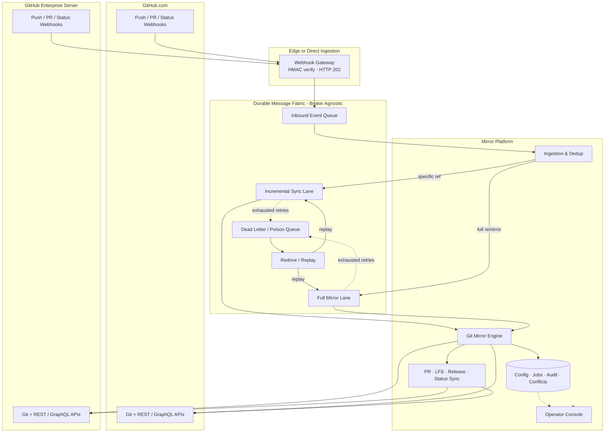

# Enterprise Git Mirroring — Architecture & Design Specification

> **Product basis:** GitMirror Hub (as built)  
> **Audience:** Platform architects, engineering leads, and enterprise stakeholders evaluating or adopting this design  
> **Scope:** Bidirectional Git object and metadata mirroring between **GitHub.com (Cloud)** and **GitHub Enterprise Server (GHES)**  
> **Note:** Core application stack and mirroring behavior are fixed to what is built today. Messaging broker and enterprise log/SIEM destinations are described at a **capability** level so they can be swapped in production without changing the mirror design.

---

## 1. Purpose & Problem Statement

Enterprises often need a durable, near-real-time mirror between:

| Role | Typical platform | Purpose |
| :--- | :--- | :--- |
| **Primary / Origin** | GitHub.com | Day-to-day developer collaboration |
| **Secondary / Replica** | GitHub Enterprise Server | On-prem DR, air-gapped failover, regulated residency, or CI/CD continuity |

A production-grade mirror must do more than `git push --mirror`. It must:

1. Survive webhook storms, API rate limits, and partial outages without data loss.
2. Avoid infinite push loops when both sides emit webhooks.
3. Preserve branches, tags, PR refs, LFS binaries, releases, and CI statuses needed for failover.
4. Detect and isolate split-brain divergence instead of silently force-overwriting trunk.
5. Remain operable for large repositories (multi-GB packs, thousands of refs) with pause/resume.

This document describes the **architecture and design of GitMirror Hub** for that GitHub.com ↔ GHES use case.

---

## 2. Design Principles

1. **Ingestion decoupled from execution** — Accept webhook events quickly (HTTP 2xx), persist them durably, and process sync work asynchronously.
2. **Zero event loss** — Durable queues with retries and a poison / dead-letter path; no silent drops during worker restarts.
3. **Loop & echo immunity** — System-generated pushes must not re-trigger mirroring.
4. **Conflict isolation over silent overwrite** — Diverged trunks are quarantined and surfaced, not blindly force-pushed (unless policy explicitly allows it).
5. **CI/CD disaster-recovery readiness** — Mirror PR refs (`refs/pull/*`), check statuses, and release metadata so pipelines can fail over without rebuilding from scratch.
6. **Secrets at rest** — Tokens and webhook secrets encrypted with envelope encryption (e.g. AES-256-GCM).
7. **Operator control** — Pause/resume consumers and individual long-running jobs; cancel queued work without poisoning the dead-letter path.
8. **Observable by default** — Structured audit trails, live job progress, volume metrics, and queue depth visibility.

---

## 3. Scope Boundaries

### In scope
- GitHub.com ↔ GHES bidirectional or unidirectional pairs
- Git refs: branches, tags, notes, PR head/merge refs
- Git LFS object transfer
- Pull request lifecycle mirroring (create / update / close)
- Releases and commit / check statuses
- Webhook-driven incremental sync and operator-triggered full remirror
- Durable messaging, retries, circuit breaking, DLQ redrive
- Operator dashboard concepts (pairs, jobs, conflicts, queue health)

### Out of scope (for this document)
- Other SCM products (GitLab, Bitbucket, Azure DevOps, etc.) — the running product may support adapters; this enterprise brief focuses on GitHub.com ↔ GHES only
- Deep broker topology (exchanges, routing keys, vendor-specific APIs) — see §6 for logical queue requirements only
- Deep SIEM product wiring — see §11 for audit/logging capabilities only

---

## 4. Current Tech Stack & What’s Built

### 4.1 Application modules

| Module | Role |
| :--- | :--- |
| **`backend/`** | Spring Boot API, JGit mirror engine, webhook ingestion, job orchestration, persistence |
| **`frontend/`** | React operator console (pairs, jobs, queues, conflicts, simulation, settings) |
| **`webhook-worker/`** | Optional edge webhook gateway (HMAC verify → durable inbound queue) |

### 4.2 Technology stack (as built)

| Layer | Technology |
| :--- | :--- |
| **Language / runtime** | Java 21+ (verified on JDK 21/23) |
| **Backend framework** | Spring Boot 4.1.1 — Web MVC, JPA, Validation, WebSocket |
| **Git engine** | Eclipse JGit 6.9 (no host `git` CLI dependency) |
| **Persistence** | H2 file-backed DB (dev/default); schema auto-evolution on startup; PostgreSQL-ready JPA model |
| **Messaging (current)** | Durable message broker via Spring messaging (dev often uses RabbitMQ / CloudAMQP). **Enterprise may substitute an equivalent durable queue fabric** as long as §6 contracts are met. |
| **Realtime UI** | SockJS / STOMP WebSocket → `/topic/sync-events` |
| **Frontend** | React 18, TypeScript, Vite, Tailwind CSS, Axios, Lucide |
| **Edge ingestion (optional)** | Cloudflare Workers + TypeScript (Wrangler) |
| **Secrets at rest** | AES-256-GCM envelope encryption (`CryptoService` / JPA converters) |
| **SCM APIs** | GitHub.com + GHES REST (`/api/v3`) and optional GraphQL fast path with REST fallback |
| **Auth to Git** | GitHub App (JWT → installation token) and/or fine-grained PATs |

### 4.3 What’s built in today (capabilities)

| Area | Built-in behavior |
| :--- | :--- |
| **Pair management** | CRUD for Cloud ↔ GHES (or Cloud ↔ Cloud) pairs; direction; branch filters; trunk conflict policy; storage tier; encrypted tokens |
| **Git mirroring** | Bare-repo fetch/push for branches, tags, notes, `refs/pull/*`; public-first source read; destination WRITE preflight |
| **Resumable bootstrap** | Default branch first, then batched refs; `completed_push_refs` ledger; abort remaining batches on first `REJECTED_*` |
| **LFS** | Parallel pointer discovery + concurrent Batch API transfer; completed OID checkpoints for resume |
| **PRs / releases / CI** | Full-mirror + dedicated actions for PRs/releases; webhook-driven PR updates; status/check replication; GraphQL snapshot fast path |
| **Conflict isolation** | Fast-forward checks; `ISOLATE` / `FAIL_JOB` / `ORIGIN_WINS`; conflict ledger + optional conflict PRs; PR metadata CAS |
| **Loop prevention** | Dedup ledger skips system-echo webhooks (`LOOP_DETECTED_SYSTEM_ECHO`) |
| **Job control** | Queue / cancel / pause / resume / skip-stage / dispatch; statuses include `PAUSED`, `INTERRUPTED`, `CONFLICT_ISOLATED`, `DEAD_LETTERED` |
| **Queues** | Inbound buffer + incremental lane + full-mirror lane + dead-letter redrive; consumer pause/resume; Ready vs in-flight observability |
| **Resilience** | Jittered retries; tri-state circuit breaker; concurrency throttle; startup pause + orphan `IN_PROGRESS` → `INTERRUPTED` |
| **Storage** | Hot / LRU / ephemeral / NAS tiers; bare-repo housekeeping / GC |
| **Observability** | Dual-write audit (`[job-{id}]` console + DB); live progress (ETA, objects, remote labels); pipeline stepper; transfer + API usage metrics |
| **Logging sinks** | Pluggable enterprise audit forwarder (console / file / HTTP / syslog-style adapters). **Concrete SIEM product is a deployment choice.** |
| **Operator UI** | Repositories, repo detail / diff, observability, queue manager, simulation lab, settings (providers, system engine, storage, logging) |
| **Chaos lab** | Pause consumers; simulate destination/origin down and 429; synthetic push webhooks |

---

## 5. Logical Architecture



The diagram maps directly onto the stack in §4: Spring Boot backend (ingestion + JGit engine + metadata sync), React operator console, optional edge webhook worker, and a durable message fabric for inbound / incremental / full / DLQ lanes.

---

## 6. Capability Requirements

### 6.1 Pair management
- Configure **repository pairs** (Cloud URL ↔ GHES URL) with direction:
  - Bidirectional
  - Unidirectional Cloud → GHES
  - Unidirectional GHES → Cloud
- Per-pair credentials (GitHub App installation tokens and/or fine-grained PATs)
- Branch filter patterns (e.g. `*`, `main,develop,release/*`)
- Trunk conflict policy (see §8)
- Visibility hints (public / private / auto) for public-first read

### 6.2 Git object mirroring
| Ref class | Refspec intent |
| :--- | :--- |
| Branches | `+refs/heads/*:refs/heads/*` |
| Tags | `+refs/tags/*:refs/tags/*` |
| PR refs | `+refs/pull/*:refs/pull/*` |
| Notes | `+refs/notes/*:refs/notes/*` |

**Local bare cache:** Maintain a persistent bare repository per pair (no working tree). Remotes named conceptually as `source` and `target`. Bare packs keep disk use ~10–25% of a full working tree.

### 6.3 Metadata mirroring
| Domain | Behavior |
| :--- | :--- |
| **Git LFS** | Discover LFS pointers in trees; transfer missing blobs via LFS Batch API; resume by completed OID ledger |
| **Pull requests** | Bulk-replicate on full-mirror jobs; realtime create/update/close via webhooks; map Cloud PR IDs ↔ GHES PR IDs |
| **Fork PRs** | Materialize dest-only heads (e.g. `fork-pr-{n}`); never force onto destination trunk |
| **Releases** | Replicate release metadata and binary assets on full-mirror / dedicated sync actions |
| **CI statuses** | Replicate commit statuses / check runs for DR verification |

### 6.4 Sync job types
| Trigger | Typical lane | Ref shape |
| :--- | :--- | :--- |
| Webhook push | Incremental | Specific branch / tag ref |
| Manual “Sync Now” / bootstrap | Full | Wildcard `*` or null |
| DLQ redrive | Same as original | Preserved |
| Dedicated Sync PRs / LFS / Releases | Metadata-only or full | Operator action |

---

## 7. Messaging & Execution Fabric

The platform requires a **durable message fabric**. The current build uses Spring messaging with a broker such as RabbitMQ / CloudAMQP in development. **Enterprise deployments may substitute another durable queue service** without changing the mirror engine, as long as the contracts below are met.

### 7.1 Logical queues / lanes

```
[Webhook Gateway / Direct Webhook]
         │  HTTP 202 Accepted
         ▼
[Inbound Event Queue]     ← durable buffer; survives worker downtime
         │
         ▼
[Ingestion + Dedup]
         │
         ├──► [Incremental Sync Lane]   ← specific refs (webhooks)
         └──► [Full Mirror Lane]        ← bootstrap / remirror / wildcard
                    │
                    ▼
            [Per-pair mutual exclusion]
                    │
                    ▼
            [Git Mirror Engine]
                    │
                    ▼ (retries exhausted)
            [Dead Letter / Poison Queue]
                    │
                    ▼
            [Operator Redrive] ──► original lane
```

### 7.2 Required queue properties
| Property | Requirement |
| :--- | :--- |
| **Durability** | Messages survive broker and consumer restarts |
| **Ack semantics** | At-least-once delivery with explicit ack after successful handling (or safe skip) |
| **Prefetch / concurrency** | Prefer low concurrency per lane (often 1) so large Git packs do not stampede |
| **Retry with backoff** | Transient failures retry with jittered exponential backoff |
| **Dead letter** | Permanent / exhausted failures route to a poison queue |
| **Redrive** | Operators can replay poison messages to the original lane after recovery |
| **Pause consumers** | Global pause without dropping inbound events (buffer in inbound + execution lanes) |
| **Observability** | Expose pending depth vs in-flight count per lane |

### 7.3 Lane separation rationale
- **Incremental lane:** Fast, small packs from day-2 webhooks.
- **Full-mirror lane:** Slow, large first bootstrap / remirror work.

Different pairs may run one full and one incremental job concurrently; **the same pair must serialize** on a shared lock to avoid pack corruption and ref races.

### 7.4 Cancel vs dead-letter
- **Cancel queued job:** Mark cancelled; consumer skips and acknowledges — must **not** enter DLQ.
- **Cancel in-flight:** Cooperative abort via progress cancellation; preserve checkpoints where possible.
- **Exhausted retries / poison:** Route to DLQ for later redrive.

### 7.5 Startup recovery
On process start (recommended default):
1. Pause execution consumers (do not auto-drain backlog).
2. Mark orphaned in-progress jobs as `INTERRUPTED` after a grace window.
3. Operators explicitly resume consumers and dispatch / resume selected jobs.

This prevents a cold start from immediately replaying multi-hour vscode-scale mirrors.

---

## 8. Conflict Isolation & Split-Brain Protection

Simultaneous commits to the same trunk on Cloud and GHES create divergence. The engine must **never silently force-overwrite** a diverged trunk unless policy says so.

### 8.1 Fast-forward check
Before pushing a trunk head, verify the destination tip is an ancestor of the incoming commit (DAG reachability). Apply on both incremental and full-mirror jobs.

### 8.2 Trunk conflict policies
| Policy | Behavior |
| :--- | :--- |
| **ISOLATE** (default) | Keep destination tip; push incoming commits to `refs/heads/sync-conflict/<branch>-<timestamp>`; open a conflict PR (`isolated → trunk`) on the destination |
| **FAIL_JOB** | Record conflict; skip that trunk; continue other refs |
| **ORIGIN_WINS** | Force-push source onto destination (designated primary → replica / DR) |

Operators may also request a one-shot `overwriteFromSource` for intentional remediation.

### 8.3 Additional conflict types
- **Tags:** Same name, different SHA → skip force-move; record `TAG` conflict.
- **PR metadata CAS:** Origin `edited` webhooks PATCH the replica only if replica title/body still match last-pushed values; CAS miss → `METADATA` conflict (do not clobber replica edits).
- **Conflict ledger:** Persist open conflicts for acknowledge / retry-open-PR workflows.
- **Isolation branches:** `sync-conflict/*` heads must never reverse-sync or be pruned by normal housekeeping.

Job outcome for isolation path: `CONFLICT_ISOLATED` with detailed audit trail.

---

## 9. Loop & Echo Prevention

```
Developer pushes Commit X to GitHub.com
        │
        ▼
Mirror receives webhook for Cloud
        │
        ├──► Pushes Commit X to GHES
        └──► Records (GHES repo, Commit X, timestamp) in dedup ledger
                │
                ▼
        GHES fires push webhook for Commit X
                │
                ▼
        Dedup match within TTL → SKIPPED (LOOP_DETECTED_SYSTEM_ECHO)
        No outbound job enqueued
```

**Requirements:**
- Ledger key: destination repository identity + commit SHA (and optionally ref).
- TTL window long enough to cover webhook delivery delay (e.g. several minutes).
- Bounded memory / eviction for high volume.
- Skipped echoes appear in job history for auditability.
- Destination-only **automated bot branches** (`dependabot/`, `renovate/`, `snyk-bot/`, `greenkeeper/`) must skip reverse-sync (`REPLICA_BOT_BRANCH`). GitHub may open these after a mirror push; they are not Hub-configured jobs and must not flow back to origin (see §10.6 and §20).

---

## 10. GitHub.com & GHES Integration

### 10.1 Authentication
| Mechanism | Use |
| :--- | :--- |
| **GitHub App (JWT → installation token)** | Preferred for org-scale installs; short-lived tokens |
| **Fine-grained PAT** | Acceptable for smaller deployments |
| **Public-first read** | Anonymous HTTPS for public sources when marked Public/Auto; credentials for private and all writes |

Destination write preflight must confirm Contents write before fetch/push. Missing **Workflows** permission (when `.github/workflows` exists) or branch rulesets may still surface as Git `REJECTED_*` and must abort remaining full-mirror batches.

### 10.2 API surfaces
- **Git smart HTTP** for fetch/push of objects and refs
- **REST API v3** (`api.github.com` and `{ghesHost}/api/v3`) for PRs, releases, statuses, permissions
- **GraphQL** (optional fast path) for open PR pages, mirror metadata snapshots, and release inventories — with REST fallback

### 10.3 Webhook events (minimum)
| Event | Purpose |
| :--- | :--- |
| `push` | Incremental branch/tag sync |
| `pull_request` | Create / update / close mirrored PRs |
| `status` / check-related | CI status replication |

**Signature:** Validate `X-Hub-Signature-256` (HMAC-SHA256) before accepting payloads.

### 10.4 Edge / high-availability ingestion (recommended)
Place a lightweight gateway in front of the platform that:
1. Verifies HMAC
2. Returns HTTP 202 quickly
3. Publishes an envelope to the **inbound event queue**

This ensures webhooks are not dropped while the mirror workers deploy or restart. Direct backend webhook endpoints remain a valid fallback.

### 10.5 Permission checklist (GitHub App)
- Contents: Read & write
- Metadata: Read
- Pull requests: Read & write (for PR mirroring)
- **Workflows: Read & write** if `.github/workflows` exists in the tree (otherwise GitHub returns `REJECTED_OTHER_REASON` on branch push)
- **Actions: Read & write** to cancel mirror-triggered workflow runs (App identity only)
- Subscribe to: Push, Pull request, Status (as needed)

### 10.6 Platform-native side effects on the replica (Actions & Dependabot)

Git object mirroring copies **files and refs**, not GitHub product settings. After the first destination push of the default branch (and `.github/`), GitHub.com / GHES may activate their own services. The Hub does not configure these; operators must test for them (§20).

| Side effect | Why it happens | Hub behavior |
| :--- | :--- | :--- |
| **GitHub Actions runs** | App / PAT pushes are **not** ignored the way workflow `GITHUB_TOKEN` is. Copying `.github/workflows` can also enable Actions on a new replica. | Optional **suppress mirror-triggered Actions** (default on): after Hub writes, cancel `queued` / `in_progress` runs attributed to the mirror App bot. Requires App installation tokens, not PATs. Does not rewrite commits with `[skip ci]` (SHA-preserving). Cloud/EMU can additionally use **Workflow execution protections** so the mirror App is excluded from the actor allow-list (runs never start). GHES may lack that policy — rely on the cancel sweeper. Human-attributed runs must not be cancelled. |
| **Dependabot PRs** | Copying `.github/dependabot.yml` **is** version-update enablement. Org/account **auto-enable Dependabot alerts / security updates** on new repos can open PRs after lockfiles land — even if nobody configured Dependabot on the replica. | Not cancelled by Actions suppression (Dependabot is a separate GitHub service, actor `dependabot[bot]`). Dest `dependabot/*` (and similar bot prefixes) inbound webhooks skip reverse-sync (`REPLICA_BOT_BRANCH`). Public→private backup pairs also block novel dest-side branches (`REPLICA_BACKUP_MIRROR`). Unidirectional A→B already drops dest→origin. |

---

## 11. Mirror Engine Deep Design

### 11.1 Execution pipeline (conceptual stages)
1. Fast-path reachability check (skip if commit already merged in local bare cache)
2. Destination write preflight
3. Source fetch (skip re-fetch when packs already on disk)
4. Conflict detection / isolation
5. Destination push (batched)
6. PR metadata sync (full-mirror)
7. Releases sync (full-mirror)
8. LFS discovery & transfer
9. Persist metrics, clear resume ledgers on success

### 11.2 Resumable bootstrap push
Large repos must not restart from zero after a network blip:

- Expand wildcard refs to per-ref specs.
- Push default branch (`main` / `master`) first as its own batch (largest pack).
- Push remaining heads/tags/notes in configurable batches.
- Persist successful refs only (`OK` / `UP_TO_DATE`) as `ref=sha` ledger entries.
- On resume, skip a head only if the **destination already has that SHA** (do not trust a poisoned ledger of rejected refs).
- First destination `REJECTED_*` (or auth failure after remint) **aborts remaining batches** on a full-mirror.

### 11.3 Cooperative pause / resume
| Status | Meaning |
| :--- | :--- |
| `PAUSED` | Operator pause; checkpoints retained |
| `INTERRUPTED` | Worker restart mid-job |
| `FAILED` / `DEAD_LETTERED` | Terminal; may still be resumable if pipeline cursor exists |

Persist:
- Per-job pipeline cursor and stage progress
- Pair-level LFS discovery / completed OID checkpoints

Operators need: pause, resume, skip-stage, dispatch.

### 11.4 Rate limiting & circuit breaker
- Cap concurrent Git pushes globally.
- Throttle secondary metadata polling per pair.
- Tri-state circuit breaker:
  - **CLOSED** — consuming normally
  - **OPEN** — pause execution consumers after N consecutive *permanent* failures; inbound events remain durable
  - **HALF_OPEN** — periodic health probe of GitHub.com / GHES; auto-resume or admin force-reset
- Temporary in-job retries must **not** count toward the consecutive failure threshold.

### 11.5 Storage tiering (scale)
For tens of thousands of pairs:

| Tier | Intent |
| :--- | :--- |
| Hot persistent | Never evict; sub-second incremental syncs |
| Auto LRU | Evict cold bare repos when disk quota exceeded |
| Ephemeral | Sync in temp space; delete after job |
| Shared NAS / NFS | Offload host disk; shared across worker nodes |

Post-sync / scheduled pack GC and housekeeping are required.

### 11.6 Volume metrics (per job)
- Wall-clock duration
- Bytes transferred (Git pack delta + LFS blobs)
- Objects received
- Source access mode (`PUBLIC` vs `AUTHENTICATED`)
- REST / GraphQL call counts vs Git smart-HTTP ops

---

## 12. Observability & Audit Logging

### 12.1 Requirements

The product ships a pluggable enterprise audit forwarder. **Which SIEM or log platform receives events is a deployment choice** (console, rolling file, HTTP collector, syslog-style, etc.) and is intentionally not prescribed here.

| Capability | Built-in behavior |
| :--- | :--- |
| **Structured audit** | Every sync phase emits timestamped, job-scoped events (`[job-{id}]` on console + DB audit rows) |
| **Secret redaction** | Tokens never appear in logs, UI, or live streams |
| **Dual visibility** | Operator console job log drawer + forwardable enterprise telemetry |
| **Live progress** | Throttled progress events (phase, %, ETA, remote label, objects) over WebSocket |
| **Pluggable sinks** | Abstract audit forwarder; concrete SIEM/log products configured at deploy time |
| **Runtime log level** | Adjust verbosity from settings UI without restart |
| **Probe** | Test sink reachability from the ops console |

### 12.2 Event categories
- Job lifecycle (`QUEUED`, `IN_PROGRESS`, `SUCCESS`, `FAILED`, `SKIPPED`, `DEAD_LETTERED`, `CONFLICT_ISOLATED`, `PAUSED`, `INTERRUPTED`, `CANCELLED`)
- Git phase boundaries (fetch begin/end, push batch results, rejects)
- Dedup skips / loop detections
- Conflict isolations
- Rate-limit warnings / circuit breaker transitions

---

## 13. Operator Console (as built)

| Surface | Capabilities |
| :--- | :--- |
| **Repository pairs** | Create/edit pairs, credentials, direction, conflict policy, storage tier |
| **Live activity** | Real-time job stream with status badges and progress (STOMP `/topic/sync-events`) |
| **Job history** | Filter by status / pair / lane; open line-by-line audit drawer; pause / resume / skip-stage |
| **Queue manager** | Pending vs in-flight per lane; pause/resume consumers; purge; DLQ redrive; cancel queued; dispatch |
| **Conflicts** | List, acknowledge, retry open conflict PR |
| **Diff inspection** | Branch ahead/behind; tags; LFS; releases; CI checks |
| **Simulation / chaos** | Pause consumers; inject 500/503/429; emit synthetic push webhooks |
| **Settings** | Providers / auth, system engine (retries, circuit breaker), storage tiers, logging sinks |

---

## 14. Resilience & Failure Scenarios

| Scenario | Expected behavior |
| :--- | :--- |
| Mirror workers down | Webhooks accepted and buffered in inbound queue |
| GHES unreachable | Retries with backoff → DLQ; circuit may open; redrive after recovery |
| GitHub.com rate limit (429) | Backoff; do not stampede; circuit on sustained permanent failure |
| Split-brain on `main` | Isolate / fail / origin-wins per policy; never silent clobber by default |
| Echo webhook from replica | Skip with `LOOP_DETECTED_SYSTEM_ECHO` |
| Dest `dependabot/*` (or renovate/snyk/greenkeeper) push | Skip reverse-sync with `REPLICA_BOT_BRANCH`; do not enqueue origin job |
| Mirror App/PAT push with workflows present | GitHub Actions **may start** on dest; with suppression on, Hub cancels App-bot `queued`/`in_progress` runs only |
| Mid-push network reset | Resume from completed ref / LFS OID ledgers |
| Process crash mid-job | Job marked `INTERRUPTED`; consumers paused until operator resume |
| Destination rejects ref | Error + abort remaining full-mirror batches |

---

## 15. Security Requirements

1. Encrypt tokens and webhook secrets at rest (AES-256-GCM).
2. Mask secrets in all outbound telemetry.
3. Validate webhook HMAC before enqueue.
4. Principle of least privilege on GitHub App / PAT scopes.
5. Prefer short-lived App installation tokens over long-lived PATs where possible.
6. Separate read (public-first) from write credential paths.
7. Audit who changed pair config and who triggered overwrite / redrive actions (recommended for enterprise hardening).
8. **Mirror Actions suppression:** App/PAT pushes trigger Actions (unlike workflow `GITHUB_TOKEN`). Keep Hub writes on GitHub App identity; enable cancel-sweeper for the App bot actor; on GitHub.com/Enterprise Cloud prefer Workflow execution protections that exclude the mirror App from the actor allow-list so human CI still runs.
9. **Dependabot is out of band:** Actions suppression does not disable Dependabot. Treat dest `dependabot[bot]` PRs as a GitHub-native consequence of mirroring `.github/dependabot.yml` / lockfiles (and org auto-enable), not as Hub-created jobs. They must not reverse-sync to origin.

---

## 16. Disaster Recovery Playbook (CI/CD Failover)

1. Confirm DLQ depth is zero (or understood) and last successful sync timestamps are fresh.
2. Retarget CI/CD remotes to the GHES replica URL.
3. Checkout mirrored `refs/pull/<id>/head` (and merge refs if present) on GHES for in-flight PR builds.
4. After primary recovery, resume bidirectional sync; echo filter discards mirror-generated loops.
5. Resolve any `CONFLICT_ISOLATED` trunks via conflict PRs before declaring failback complete.

---

## 17. Non-Functional Targets (Suggested SLOs)

| Concern | Target guidance |
| :--- | :--- |
| Webhook ACK latency | Tens of milliseconds at the edge / ingress |
| Incremental sync (small push) | Seconds to low minutes under healthy conditions |
| First bootstrap (large monorepo) | Minutes to hours; must be resumable |
| Event durability | No acknowledged webhook lost across restarts |
| Disk growth | Bounded via bare repos + tiered eviction |
| API friendliness | Stay under GitHub/GHES secondary rate limits via throttles |

Exact numbers should be tuned to org size and GHES hardware.

---

## 18. Delivered vs enterprise-swappable

### Already delivered in GitMirror Hub
- Pair CRUD + encrypted credential store
- Durable inbound queue + incremental / full execution lanes + DLQ redrive
- HMAC-validated webhook ingestion (Cloud + GHES)
- Dedup ledger for echo suppression
- Bare-repo JGit mirror engine with refspecs including `refs/pull/*`
- Fast-forward conflict detection + `ISOLATE` / `FAIL_JOB` / `ORIGIN_WINS`
- Resumable batched push + LFS OID checkpoints + parallel LFS
- PR / release / status metadata sync (GraphQL fast path + REST fallback)
- Circuit breaker + jittered retries + concurrency throttle
- Storage tiers + housekeeping
- Pluggable audit / SIEM sink interface
- Operator console: jobs, queues, conflicts, pause/resume, simulation lab
- Startup: pause consumers; mark orphan jobs `INTERRUPTED`

### Typically swapped or hardened in enterprise
- Message broker / queue fabric (keep §7 lane contracts)
- Log / SIEM destination behind the pluggable audit forwarder
- Database (H2 → managed PostgreSQL or equivalent)
- Edge webhook hosting (Cloudflare Worker → enterprise API gateway / ingress)
- HA / multi-node workers sharing NAS tier and DB

---

## 19. Verification & acceptance test conditions

Use these conditions on a GitHub.com ↔ GHES (or Cloud ↔ Cloud) pair after a full remirror of a source that contains `.github/workflows` and, where applicable, `.github/dependabot.yml` / package manifests. Distinguish **Hub-authored** activity (`{mirror-app}[bot]`) from **GitHub-native** activity (`dependabot[bot]`, workflow runs).

### 19.1 GitHub Actions enablement during mirroring

| ID | Condition to test | Pass criteria |
| :--- | :--- | :--- |
| **ACT-1** | App/PAT mirror push **does** trigger Actions | Destination has an `on: push` (or PR) workflow. After Hub pushes the default branch, dest **Actions** shows a run created for the Hub write actor. (GitHub does not ignore App/PAT the way it ignores `GITHUB_TOKEN`.) |
| **ACT-2** | Copying workflows can **enable** Actions on a new replica | Fresh dest repo (Actions never configured by the operator). After first mirror of `.github/workflows`, dest Settings → Actions is enabled / runs are allowed unless org policy forbids it. Hub did not toggle this setting. |
| **ACT-3** | Suppression **on** + GitHub App write | System Engine **Suppress mirror-triggered Actions** enabled; dest write is an installation token (`ghs_`). After Hub push/PR write, `queued` and `in_progress` runs whose actor is `{app-slug}[bot]` are **cancelled**. `completed` runs are left unchanged. |
| **ACT-4** | Suppression does **not** cancel human CI | A human (or non-mirror App) push on dest starts a workflow. Hub cancel sweeper must **not** cancel that run. |
| **ACT-5** | Suppression **on** + PAT write is rejected | Dest write credential is a PAT (`ghp_` / `github_pat_`). Job fails preflight with an Actions-suppression / App-identity error; no silent push. |
| **ACT-6** | Suppression **off** | Toggle off. Mirror push may leave dest workflow runs running; Hub does not cancel them. |
| **ACT-7** | Missing **Workflows** permission | Source tree has `.github/workflows`; dest App lacks Workflows R/W. Branch push fails `REJECTED_OTHER_REASON` (or equivalent); full-mirror **aborts remaining batches**. |
| **ACT-8** | Missing **Actions** permission with suppression on | Hub git push may still succeed; cancel sweeper cannot list/cancel runs (warn in audit). Dest may keep queued/in-progress App-bot runs. |
| **ACT-9** | PR metadata writes also trigger Actions | Full-mirror or Sync PRs creates/updates a dest PR that matches a workflow `on: pull_request`. Suppression (when on) cancels App-bot runs from that write as well as from git push. |
| **ACT-10** | SHA-preserving: no `[skip ci]` rewrite | Dest commit SHAs for mirrored refs **equal** source SHAs. Hub must not amend messages to skip CI. |
| **ACT-11** | Cloud/EMU hard block vs GHES | On GitHub.com / Enterprise Cloud, Workflow execution protections that **exclude** the mirror App: App-bot runs **never start**. On GHES without that policy, only the cancel sweeper applies (ACT-3). |
| **ACT-12** | Failover CI still works for humans | After ACT-3/ACT-11, a human push or a non-excluded actor on dest still runs workflows (DR / failback CI is not globally disabled). |

### 19.2 Dependabot during mirroring

| ID | Condition to test | Pass criteria |
| :--- | :--- | :--- |
| **DEP-1** | Hub does **not** configure Dependabot | Dest Settings → Code security / Dependabot was not set by GitMirror Hub APIs. Any enablement is GitHub-native (file copy or org auto-enable). |
| **DEP-2** | Version updates after `.github/dependabot.yml` lands | Source default branch contains `.github/dependabot.yml`. After first dest default-branch push, dest may open PRs authored by **`dependabot[bot]`** (version updates). This can occur during/shortly after mirroring without dest-side Dependabot setup. |
| **DEP-3** | Security updates without a YAML | Org/account **automatically enable Dependabot alerts / security updates** on new repos. After lockfiles / manifests land, dest may open `dependabot[bot]` security PRs even if `dependabot.yml` is absent. |
| **DEP-4** | Actions suppression does **not** stop Dependabot | With ACT-3 enabled, `dependabot[bot]` PRs and Dependabot-created branches still appear. Cancel sweeper only targets the **mirror App** actor, not Dependabot. |
| **DEP-5** | Dest bot-branch webhook is not reverse-synced | Bidirectional pair. Push (or Dependabot open) on dest `dependabot/**` (also `renovate/`, `snyk-bot/`, `greenkeeper/`). Hub job is **SKIPPED** with `REPLICA_BOT_BRANCH`; origin does **not** receive that branch. |
| **DEP-6** | Public → private backup extra guard | Pair is public A → private B, bidirectional. Novel dest-side branch (Dependabot or otherwise) is skipped (`REPLICA_BACKUP_MIRROR` and/or `REPLICA_BOT_BRANCH`); public upstream is unchanged. |
| **DEP-7** | Unidirectional A → B | Dest Dependabot activity never enqueues a B→A sync (direction filter), even if bot-branch skip were absent. |
| **DEP-8** | Copied origin Dependabot PRs vs native dest Dependabot | If PR sync replicates an origin Dependabot PR, dest PR **author is the Hub App** (or mapped actor), not necessarily `dependabot[bot]`. Native dest Dependabot (DEP-2/3) is `dependabot[bot]`. Testers record which author they observed. |
| **DEP-9** | Source `dependabot/*` branches are git-copied | Branch pattern `*`. Origin `dependabot/*` heads exist. After full git mirror, dest has the same branch names/SHAs (git object copy). This is **not** the same as GitHub opening new dest PRs (DEP-2). |
| **DEP-10** | Remirror restores deleted YAML | Operator deletes dest `.github/dependabot.yml`. Next full remirror from origin **restores** the file (no Hub filter strips it). Dependabot may reactivate. |

### 19.3 Combined / negative checks

| ID | Condition to test | Pass criteria |
| :--- | :--- | :--- |
| **MIX-1** | Loop ledger still holds | Hub’s own dest push (including PR-head materialization) still skips as `LOOP_DETECTED_SYSTEM_ECHO` when the echo webhook arrives. |
| **MIX-2** | Operator warning for public→private bidirectional | Creating/editing a public A / private B pair with bidirectional direction surfaces the Dependabot reverse-sync warning in the pair UI. |
| **MIX-3** | Auditability | SKIPPED jobs for `REPLICA_BOT_BRANCH`, `LOOP_DETECTED_SYSTEM_ECHO`, and (when used) Actions-cancel counts are visible in job history / metrics — not silent drops. |

---

## 20. Glossary

| Term | Definition |
| :--- | :--- |
| **Pair** | Configured mapping between a Cloud repo and a GHES repo |
| **Lane** | Logical execution queue (incremental vs full) |
| **Bare cache** | Local `--bare` Git repository holding packs for a pair |
| **Echo / loop** | Webhook caused by the mirror’s own push |
| **Isolation branch** | `sync-conflict/*` head holding diverged commits |
| **Redrive** | Replaying poison-queue messages onto an execution lane |
| **Full mirror** | Wildcard remirror of refs + typically metadata phases |
| **Incremental sync** | Single-ref sync driven by a push webhook |
| **Actions suppression** | After Hub writes, cancel dest workflow runs attributed to the mirror App bot (`queued` / `in_progress` only) |
| **Workflow execution protections** | GitHub.com / EMU org policy that can prevent the mirror App from *starting* Actions runs |
| **Dependabot (native)** | GitHub service that may open dest PRs as `dependabot[bot]` after mirrored YAML/lockfiles land; not Hub-configured |
| **`REPLICA_BOT_BRANCH`** | Skip reason: dest automated bot branch (`dependabot/` and similar) is not reverse-synced |

---

## Document Control

| Field | Value |
| :--- | :--- |
| Basis | GitMirror Hub as built (README + architecture + current codebase) |
| Focus | GitHub.com ↔ GitHub Enterprise Server only |
| Stack | Documented as built (Java 21 / Spring Boot 4.1 / JGit / React 18) |
| Messaging | Logical lane requirements only — broker may change in enterprise |
| Logging | Capability + pluggable sinks — SIEM product may change in enterprise |
| Intent | External architecture & design doc for enterprise adoption / similar builds |
