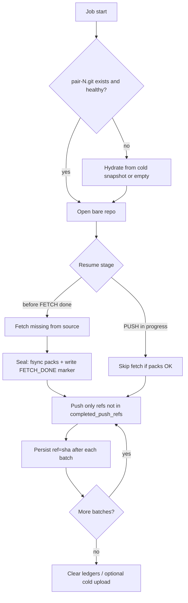

# Future plan: Resume, cache lifecycle & worker affinity

> **Status:** Partial — resume ledgers and in-process pair lock shipped; distributed lease, fetch seal, LRU in-flight skip, cold snapshots, and shard affinity are still pending.  
> **Folder:** [`future-work/`](README.md)  
> **Inspired by:** Continuity (Cursor Origin) — object-store WAL as truth, local NVMe as rebuildable Git cache — adapted for a **mirror relay** (truth = GitHub/GHES, not Hub).  
> **Non-goal:** Continuity-style git hosting or running JGit against R2/S3 as the live `objects/` store.

## Problem

At scale (many pairs, large monorepos, multi-worker):

1. **Resume** still risks re-fetch / re-push when packs and ledgers diverge after crash or LRU eviction.
2. **Cache** is disk-local cattle in principle (`AUTO_LRU` / ephemeral / NAS) but lacks a cold-snapshot hydrate path.
3. **Workers** are undifferentiated — no preference for the node that already has `pair-{id}.git`, so warm-cache wins are accidental.

## Goals

| Goal | Success signal |
| :--- | :--- |
| Crash mid-bootstrap loses minimal Git network work | Resume continues from sealed fetch + unfinished push batches |
| Disk stays bounded without punishing cold pairs | Evicted pairs hydrate from snapshot or clearly fall back to source fetch |
| Multi-worker incremental sync hits warm cache | Same `mappingId` prefers same worker/shard; lock prevents cross-node corruption |

## Non-goals

- Replacing GitHub/GHES as source of truth
- Full Continuity / S3 WAL hosting stack
- FUSE/R2 as live bare-repo filesystem
- Changing Actions-suppression design (orthogonal; already shipped)

## Shipped (keep)

- Bare repos: `pair-{mappingId}.git` via `StorageTieringService`
- Tiers: `HOT_PERSISTENT`, `AUTO_LRU`, `EPHEMERAL_STREAM`, `NAS_MOUNT`
- Resume: `completed_push_refs`, `sync_checkpoint_stage`, LFS OID ledgers, job `pipeline_json` / `INTERRUPTED`
- Skip source fetch when packs already on disk
- Push batching + per-batch ledger
- Startup: pause consumers; operator dispatch
- In-process `repoLocks` per `mappingId` in `QueueConsumerService` (same JVM only)



---

## Phase 0 — Correctness foundations (do first)

**Effort:** small–medium · **Deps:** none

1. **Ledger ↔ disk consistency** — **pending**
   - On resume: if bare repo missing/corrupt → clear `completed_push_refs` (+ related fetch markers); do not trust push ledger alone.
   - Optionally verify dest already has SHA before skipping a ref.

2. **In-flight pair lock** — **partial**
   - **Shipped:** in-process `ReentrantLock` per mapping.
   - **Pending:** DB/Redis lease per `mappingId` for multi-worker.

3. **Evict safety** — **pending**
   - LRU must never delete `pair-N.git` while job for N is `IN_PROGRESS` / `PAUSED` / `INTERRUPTED` with active resume. Current hourly LRU does not skip in-flight jobs.

**Exit:** kill -9 mid-full-mirror → restart → no corrupt ledger; no double-writer on same pair.

**Touchpoints:** `StorageTieringService`, `SyncCheckpointService`, `GitSyncEngine`, new lease helper, `RepoMapping` / job status queries.

---

## Phase 1 — Resume hardening (fetch seal + pack trust) — pending

**Effort:** medium · **Deps:** Phase 0

1. **Fetch seal** after successful source fetch (and after pack IO housekeeping):
   - Persist `fetch_sealed_at` / generation + tip summary (file under bare repo and/or columns on `repo_mappings`).
   - Mark `FETCH_SOURCE` done only after seal.

2. **Resume rules**
   - Seal present + packs healthy → skip/narrow fetch.
   - Seal absent → treat packs as untrusted; re-fetch as needed.
   - Push stage: only refs not in ledger **or** whose local/dest SHA mismatch.

3. **Optional (large monorepos):** stash new pack files to cold object storage keyed by `mappingId + pack identity`; on disk wipe, rehydrate packs before negotiation.

**Exit:** interrupt after fetch / mid-push → resume without full re-download of already-sealed packs; push continues from next batch.

**Touchpoints:** `GitSyncEngine`, `SyncCheckpointService`, `BareRepoHousekeeping`, `RepoMapping` fields.

---

## Phase 2 — Cache lifecycle (cattle + optional cold tier) — pending

**Effort:** medium–large · **Deps:** Phase 0; Phase 1 recommended

### 2a — Lifecycle states (always)

Per pair: `EMPTY | HOT_LOCAL | SNAPSHOTTED_COLD | MISSING`

- Touch `lastAccessedAt` on resolve/sync.
- Extend LRU: quota / max cached / retention; skip locked & HOT pins.

### 2b — Cold snapshot (optional, R2/S3-compatible)

On safe eviction of `AUTO_LRU`:

1. Quiesce pair (no lease).
2. Snapshot bare repo (`tar.zst` or pack+refs manifest).
3. Upload to bucket `gitmirror-cache/pair-{id}/{generation}`.
4. Record `cold_snapshot_uri` + generation; delete local dir; set `SNAPSHOTTED_COLD`.

On job start:

- Local hit → open.
- `SNAPSHOTTED_COLD` → hydrate → open → sync.
- No snapshot → empty bare + source fetch.

**EPHEMERAL:** no snapshot (current).  
**NAS_MOUNT:** shared FS; skip object cold tier.  
**HOT:** never evict.

**Config (illustrative):** `coldSnapshotEnabled`, bucket/credentials, min idle before snapshot+evict, max snapshot bytes.

**Exit:** evict 100 idle pairs under quota; later sync of one hydrates from snapshot faster than full remirror (measure).

---

## Phase 3 — Worker affinity — pending

**Effort:** medium · **Deps:** Phase 0 lock; multi-instance deploy

### Recommended v1: soft shard affinity

- Partition work by `hash(mappingId) % shardCount` (or consistent hash).
- Queues or consumer tags per shard (`git.sync.shard.{i}`).
- Each worker owns one or more shards → natural warm cache.

**Failover:** reassign shard on worker death → accept cold hydrate / snapshot hydrate.

### Alternative: prefer-local claim

- Shared queue; worker takes job if local `pair-N.git` exists or it is primary hash owner; else delayed requeue; timeout → any worker.

### With NAS

- Affinity optional; **lease still mandatory**.

**Exit:** metrics show cache-hit rate by pair; incremental jobs on sticky shard skip most fetch bytes.

**Touchpoints:** `RabbitMQConfig`, `QueueConsumerService`, `QueueProducerService`, deploy topology, optional operator shard map UI.

---

## Phase 4 — Observability & ops — pending

- Metrics: cache hit/miss/hydrate, resume-from-seal vs full-fetch, eviction count, lease wait/timeout, bytes saved on resume.
- Audit via `EnterpriseLoggingService`.
- Queue Manager: show pair cache state + shard.
- Runbook: recover from poison snapshot; force clear cache; rebalance shards.

---

## Suggested sequencing

```text
Phase 0 (correctness) → Phase 1 (resume) → Phase 3 (affinity, when N>1 workers)
                              ↘
                            Phase 2b (cold R2) when disk pressure justifies it
```

Phase 2a (access tracking + safer LRU) can ship with Phase 0/1 without object storage.

## Effort sketch

| Phase | Rough effort | Priority |
| :--- | :--- | :--- |
| 0 Correctness | days | P0 |
| 1 Resume seal | ~1 week | P0 |
| 2a Lifecycle metadata | days | P1 |
| 2b Cold R2 snapshots | 1–2 weeks | P2 (when needed) |
| 3 Affinity | ~1 week + deploy | P1 when multi-node |
| 4 Metrics/runbook | days | with each phase |

## Risks

| Risk | Mitigation |
| :--- | :--- |
| Snapshot of corrupt bare repo | Seal + integrity check before upload; generation IDs |
| Hydrate slower than fetch for small repos | Size threshold; skip snapshot below N MB |
| Shard imbalance | Consistent hash; manual rebalance |
| Lease deadlock | TTL + heartbeat; operator force-release |
| Scope creep into Continuity | Keep object store as **cache WAL/snapshots only** |

## Acceptance themes

1. Kill mid-full-mirror → resume without starting push from ref 0.
2. LRU eviction never races an active job.
3. Two workers never mutate the same pair bare repo concurrently.
4. Sticky shard → measurable fetch-byte reduction on day-2 incremental sync.
5. (If 2b) Cold pair returns via hydrate with lower GitHub fetch volume than empty-cache remirror.

## Related reading

- Cursor: [Git at any scale](https://cursor.com/blog/git-at-any-scale) (Continuity — learn principles, do not clone hosting stack)
- Hub: [`ARCHITECTURE.md`](../ARCHITECTURE.md) storage tiers & resume sections
- Sibling backlog: [`fanout-concurrency.md`](fanout-concurrency.md)
