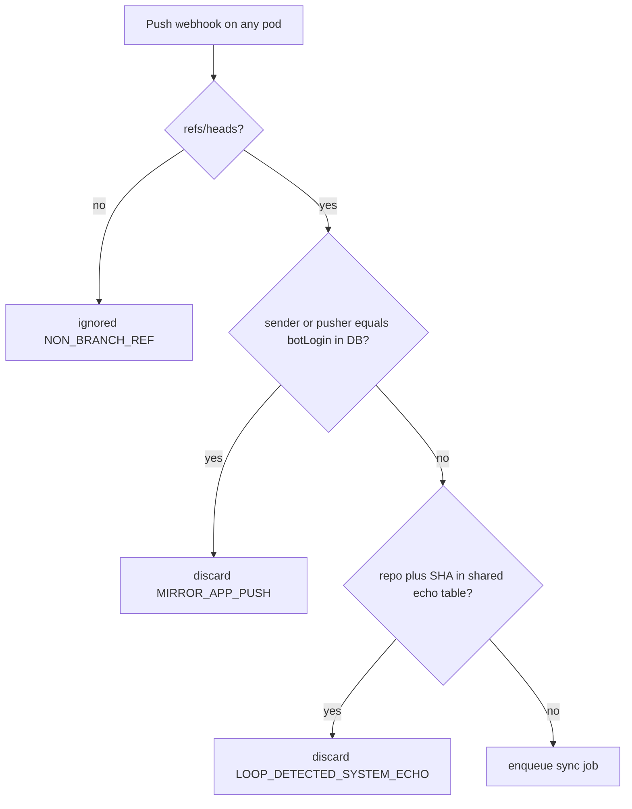

# Done: Read-only replica ruleset and shared echo ledger

> **Status:** Repository slice complete. Org and enterprise controls are a separate screen: [`org-enterprise-ruleset-ui.md`](org-enterprise-ruleset-ui.md).  
> **Shipped:** GitHub/GHES ruleset `gitmirror-replica-readonly` (lock, unlock, swap), shared `echo_ledger` so any pod drops mirror echoes, App `botLogin` skip (`MIRROR_APP_PUSH`), and the existing divergence policy on every branch that already exists on the destination. Tag rulesets were left out of this slice.

Work to do: Hub can lock one side of a GitHub or GHES pair so humans cannot push there, the mirror App still can, and that App’s webhook is dropped before any sync job starts. Trunk isolation stays as the backstop.

## Outcome

- Operators choose a primary side (A or B). The other side is the replica.
- Hub creates or updates a repository ruleset named `gitmirror-replica-readonly` on the replica and sets `enforcement` to `active`.
- The mirror GitHub App is the only bypass actor. Human pushes to the replica are rejected by GitHub or GHES and never become webhooks.
- When the App’s push does land, whichever pod receives the webhook drops it. The pushing pod writes the tip SHA into the shared database before `git push`. The receiving pod reads that row. It also drops the event when `sender.login` or `pusher.name` matches the credential `botLogin`. No reverse job is queued.
- Failover locks the old primary first, then unlocks the replica.
- If the ruleset is missing or briefly off, diverged branches (trunk and feature) follow `trunkConflictPolicy` instead of a silent force-push.

## Scenarios

A job always runs one way: the webhook’s repo is source, the other side is destination. Bidirectional mode swaps that on the next webhook. Trunk names are `main`, `master`, `trunk`, or a branch starting with `release` or `prod` (`GitSyncEngine.isTrunkBranch`).

### Already mitigated before this work

**Fast-forward on a trunk.** Dev A commits on GitHub `main`. The mirror pushes that commit to GHES. Dev B commits on GHES on top of that tip. The GHES commit is a descendant of the destination tip, so `RevWalk.isMergedInto` is true and the job fast-forwards. No conflict row.

**Diverged trunk, default policy.** Both sides commit on `main` from the same parent before either sync finishes. Neither tip is an ancestor of the other. With `trunkConflictPolicy=ISOLATE` (the default on `RepoMapping`), the destination tip stays. Incoming commits go to `refs/heads/sync-conflict/<branch>-<utc timestamp>`. `SyncConflictService` writes a `GIT_REF` row (`OPEN`) and, on a bidirectional pair, opens a destination PR from that branch into the trunk. Job status is `CONFLICT_ISOLATED`. `sync-conflict/*` is never reverse-synced or deleted (`RefOriginService`).

**Diverged trunk, other policies.** `FAIL_JOB` records the conflict and skips that ref; other refs in a full mirror still push. `ORIGIN_WINS` force-pushes source onto the destination and drops the destination-only commits. Unidirectional pairs and a one-shot `overwriteFromSource` also force. Those two paths are intentional data loss of the destination tip.

**Published tag moved.** Same tag name, different SHA. The engine skips the force-move and records a `TAG` conflict (`policy` stored as `FAIL_JOB`). The destination tag stays.

**PR title or body edited on both sides.** Origin `edited` webhooks PATCH the replica only when the replica still matches `lastPushedTitle` / `lastPushedBody`. A miss records a `METADATA` conflict and leaves the replica text. Git commits are not involved.

**Branch delete.** A delete webhook pushes a delete refspec only when `RefOriginService.shouldPropagateDelete` says this side owns the branch. Protected trunks, `sync-conflict/*`, and synthetic `fork-pr-*` heads are never deleted. A delete the mirror itself pushed is dropped as `LOOP_DETECTED_SYSTEM_ECHO` when it is still in the delete ledger.

**Mirror push echoing back (same pod only, before this work).** After a successful push batch, `GitSyncEngine.recordShasOnLedger` called `DedupLedgerService.recordSystemPush`. That service was a `ConcurrentHashMap` on the pod that pushed. If the destination webhook was handled by that same JVM within 600 seconds, it was discarded as `LOOP_DETECTED_SYSTEM_ECHO`. `pair_leases` do not help: they stop two pods from Git-writing one pair, and the echo check runs on the HTTP pod before a job exists. Fleet tables (`sync_jobs`, `pair_leases`, heartbeats) are shared. That map was not.

**Unidirectional pair.** A webhook from the non-source side is discarded as `DIRECTION_IGNORED` before any Git work.

**Replica-originated ref on a later job.** If `ref_origins` already says the branch was born on the other side, `shouldOmitHeadPush` skips pushing it back, and `isReplicaEvent` drops the webhook as `ORIGIN_SIDE_REPLICA`.

### Not mitigated before this work

**Same feature branch, both sides.** This is the data-loss case. Incremental jobs and full-mirror both queued `+refs/heads/<branch>:refs/heads/<branch>` for anything that was not a trunk (`GitSyncEngine` around the non-trunk `else` and `maybeAddRefSpec`). The `+` is a force update. Example: both developers commit on `feature/login` from the same parent, one on GitHub and one on GHES. The later job overwrites the other tip. Those commits leave the branch. No `sync_conflicts` row. Isolation never runs.

**Echo on another pod.** Pod A pushes commit X to the replica and stores X only in its own map. The load balancer delivers the replica webhook to pod B. Pod B’s map is empty, so it enqueues a reverse job and can push X back, then the next echo continues the loop. A restart of pod A, or a webhook after the 600 second TTL, does the same. Nothing checked `sender.login` against `botLogin`.

**Ruleset or branch protection rejects the mirror.** Destination WRITE preflight only checks Contents write. A ruleset that does not bypass the App, or a missing Workflows permission, still fails the push as `REJECTED_*` and aborts the rest of a full-mirror batch. This remains true after the work. The ruleset client does not change the preflight.

**PR merge or review on both sides.** Closing a replica PR does not merge it. Reviews, comments, and merge authority are not synced ([`pr-sync-parity.md`](../pr-sync-parity.md)). A merge on the replica moves the trunk and then hits the trunk rules above. Not part of this slice.

**Notes.** A different notes SHA is force-pushed. No conflict row. Not part of this slice.

**GitLab / Bitbucket.** No rulesets API. This work is GitHub.com and GHES only. Those hosts stay on the engine policies.

### Mitigated by this work

| Scenario | How |
|---|---|
| Human pushes the replica while it is locked | GitHub/GHES rejects the push. No webhook. |
| App or PAT push to the replica, webhook on any pod | Pushing pod inserts `(repo, sha)` into the shared echo table before `git push`. Receiving pod finds that row and discards. App pushes also match `botLogin`. |
| Failover | Lock old primary, then unlock replica. The overlap where both are writable does not happen. |
| Ruleset absent, feature branch diverged | Same policy as trunks (`ISOLATE` by default), so the destination tip is kept. |

## Ruleset on GitHub and GHES

Same REST resource. GHES prefix is `https://<ghes-host>/api/v3`. Repository rulesets are documented on GHES 3.20 through 3.22. Older GHES is out of scope for the API client; operators keep using isolation there.

Permission: repository **Administration: Read and write**, which Hub already requires to create repos. Git push still needs **Contents: Read and write**. A Contents-only App cannot create the ruleset, and an App that is not on the bypass list cannot push once the ruleset is active.

`actor_id` is the GitHub App id from the App settings page, or the `id` field from `GET /app`. It is **not** the installation id. On an installation payload the App id is `app_id`; the installation’s own `id` is the one to ignore. In this repo that is `ScmCredential.appId` / `GitHubAppConfig.appId`. On GHES, use that appliance’s App id, not the github.com one. Do not add repository admins or org owners to the bypass list. They are not exempt unless listed. `IntegrationInstallation` is not a valid bypass actor type.

### What the ruleset contains

- Name: `gitmirror-replica-readonly` (Hub looks this name up if the id was not stored).
- Target: `branch`.
- Conditions: `ref_name.include = ["~ALL"]` so every branch is covered, including feature branches. `~DEFAULT_BRANCH` would leave the force-push hole open.
- Rules: `creation`, `update` with `update_allows_fetch_and_merge: false`, and `deletion`. Together these block new branches, pushes, the “update branch” button, and deletes for anyone who is not a bypass actor.
- Bypass: one actor, `actor_type: Integration`, `bypass_mode: always`, `actor_id` = App id.
- Optional second ruleset, same name prefix, `target: tag`, same three rules, same bypass. Humans cannot move tags. The engine already refuses a tag force-move. **Not built in this slice.**

### Set it in the GitHub UI (manual fallback)

On the replica repo: Settings → Rules → Rulesets → New ruleset → New branch ruleset.

- Name `gitmirror-replica-readonly`, enforcement Active.
- Target branches: Include all branches.
- Rules: Restrict creations, Restrict updates (uncheck “Allow fork sync”), Restrict deletions.
- Bypass list: Add the mirror GitHub App only. Bypass mode Always.
- Create.

GHES: same screens under the appliance’s repo settings.

### Set it with the API (what Hub calls)

Create:

`POST /repos/{owner}/{repo}/rulesets`

```json
{
  "name": "gitmirror-replica-readonly",
  "target": "branch",
  "enforcement": "active",
  "bypass_actors": [
    { "actor_id": 123456, "actor_type": "Integration", "bypass_mode": "always" }
  ],
  "conditions": { "ref_name": { "include": ["~ALL"], "exclude": [] } },
  "rules": [
    { "type": "creation" },
    { "type": "update", "parameters": { "update_allows_fetch_and_merge": false } },
    { "type": "deletion" }
  ]
}
```

`123456` in that body is the App id. Turn off and on without deleting the ruleset. `evaluate` is not valid on a repository ruleset.

`PUT /repos/{owner}/{repo}/rulesets/{ruleset_id}` with the same body and `"enforcement": "disabled"` or `"active"`.

Find the id: `GET /repos/{owner}/{repo}/rulesets` and match the name.

Swap primary, in this order, so both sides are never writable together:

1. `PUT` the new replica (old primary) to `enforcement: active` (create it first if missing).
2. Confirm that PUT succeeded.
3. `PUT` the new primary (old replica) to `enforcement: disabled`.

Org rulesets (`POST/PUT /orgs/{org}/rulesets`) are not in this slice. One ruleset per replica repo is enough and matches mixed orgs.

### Code

- `GitHubRulesetClient`, called from `GitHubProviderService` and `GitHubEnterpriseProviderService`: list by name, create, set enforcement.
- Store on the pair: primary side, replica ruleset id, enforcement (`RepoMapping`).
- Pair actions: lock replica, unlock replica, swap primary (`ReplicaRulesetService`, `POST /api/v1/mappings/{id}/replica-ruleset`). Swap uses the order above. Fail the action if Administration write is missing or the App id is absent, and do not unlock the old replica if locking the new one failed.
- Pair settings UI: writable primary, Lock replica, Unlock replica, Swap primary.

## Where an echo stops, on any pod

The ruleset does not stop the App. Bypass is what lets the App push. GitHub still emits a `push` webhook, and the load balancer can send it to a pod that did not perform the push.

`botLogin` on the credential is already in the shared database, so an App-sender check works on every pod. It is not enough on its own. PAT mirrors have no `[bot]` login. A full mirror also pushes many tip SHAs, and the webhook `sender` is only the App when that credential is an App. The SHA has to be recorded where every pod can read it.

### Shared echo table

`DedupLedgerService` writes rows in the same database as `pair_leases` and `sync_jobs` (file H2 with `AUTO_SERVER` for local multi-pod, PostgreSQL for a real fleet, Mongo when that store is selected). The in-memory map remains only for unit tests that construct the service with no store.

- Row: normalized repo key, token (commit SHA, `deleted:<ref>`, or `pr:<number>`), `expires_at` (same 600 second TTL unless `git-utility.dedup.ledger-ttl-seconds` is set). The id is a hash of repo key + token so a second write refreshes expiry.
- Write each tip SHA **before** the `git push` of that batch, in `GitSyncEngine` and in `PullRequestSyncService` batch pushes. The webhook cannot arrive before the row exists.
- Read it from `WebhookIngestionService` in the existing `isSystemGeneratedEcho` / `isSystemGeneratedRefDelete` checks. Discard reason stays `LOOP_DETECTED_SYSTEM_ECHO`.
- Same for ref deletes (`recordSystemRefDelete`).

`sync_jobs.commitSha` is not a substitute. A full-mirror job has one triggering SHA and many pushed tips. Those extra SHAs were only in the map before this work.

### App login, still on the webhook

In the push handler, after the ref is known to be a branch and before `enqueueSyncJob`, compare `GitHubPushPayload.sender.login` and `pusher.name` to `ScmCredential.botLogin` for the inbound side (`{app-slug}[bot]`, set in `ScmCredentialService`). Discard reason `MIRROR_APP_PUSH`.



Do not filter on branch name. `RefOriginService.isAutomatedBotBranch` only matches dependency-bot branch prefixes on side B. That does not see the mirror App.

### PRs and other metadata

Not every echo used the in-memory map. Only Git tip SHAs and ref deletes did. Moving `DedupLedgerService` onto the shared table covers every caller of `recordSystemPush` / `recordSystemRefDelete`, including PR head materialization in `PullRequestSyncService` (`recordDestPushOnLedger`). Those still arrive as `push` webhooks. They do not need a second ledger.

| Echo | Where it was recorded | Multi-pod |
|---|---|---|
| Branch push, including a PR head the mirror pushed | `DedupLedgerService` map | Was broken. Fixed by the shared SHA table. |
| Ref delete the mirror pushed | Same map | Was broken. Same table. |
| PR opened / edited / closed | `pr_mappings` (`targetPrNumber`, `originSide`, `lastPushedTitle`, `lastPushedBody`) | Already shared. An `opened` echo is ignored once `findExistingPr` sees the row. An `edited` or `closed` echo that arrives on the replica is ignored because `inbound != originSide`. |
| PR create race | Row is saved only after `createPullRequest` returns | Was open. The replica `pull_request` webhook could hit another pod before the insert commits, and that pod would create a second PR back on the primary. |
| Commit status | No ledger. `replicateCommitStatus` always writes side B | No ping-pong. A status webhook from B is written to B again. Idempotent, not a reverse sync. Left as-is. |
| Releases | No release webhook handler. Sync compares both listings and skips an unchanged tag | No echo loop. Left as-is. |
| Actions run cancel | `ActionsTriggerSuppressionService.jobStartedAt` map | Separate from content echo. Not part of this ledger. |

The PR create race is closed in the webhook handler, not with a new store. On `pull_request`, before `handlePrWebhookEvent`, discard when `sender.login` is that side’s `botLogin` (`MIRROR_APP_PUSH`). For a PAT, which has no bot login, insert a shared echo row `(repo, pr:<number>)` immediately after `createPullRequest` returns and before any other work, and have the PR handler treat that row like `findExistingPr`. Edits and closes stay on `pr_mappings`; they are already visible to every pod once the row exists.

## Backstop in the sync engine

In `GitSyncEngine`, branches that already have a destination tip and are not a fast-forward go through `resolveTrunkPushSpec` / `decideTrunkPush`. `ISOLATE`, `FAIL_JOB`, and `ORIGIN_WINS` apply to those branches, not only trunks. Fast-forwards stay normal pushes. New branches (no destination tip) still create the ref.

This does not replace the ruleset. It keeps both histories when someone pushes the replica while the ruleset is off.

## Docs

[`ARCHITECTURE.md`](../../ARCHITECTURE.md) section 8 describes the shared echo table and the App-sender skip. [`INSTRUCTIONS.md`](../../INSTRUCTIONS.md) has the lock / swap steps and the Administration permission.
