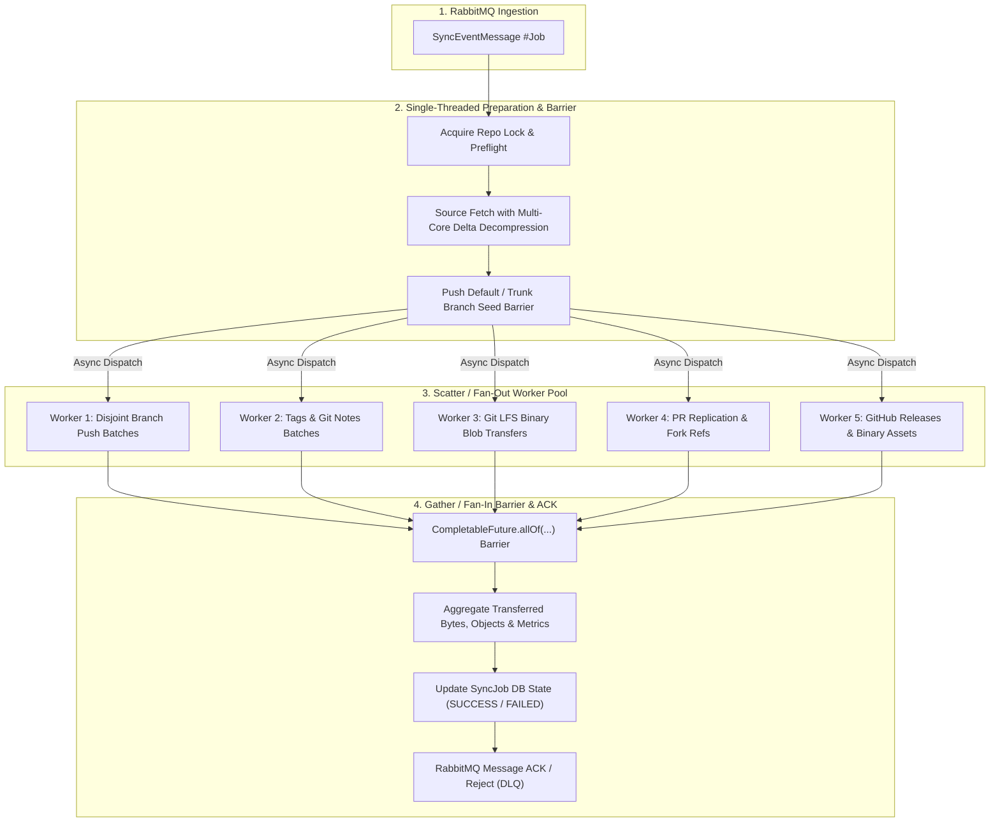

# Future Plan: In-Job Fan-Out / Fan-In Multi-Threaded Git Mirroring

> **Status:** Partial — LFS transfer and PR-create thread pools shipped; Git ref-push batches and scatter-gather ACK are still sequential.  
> **Target Milestone**: Post-V1 Stability Testing  
> **Risk Level**: High (Requires careful testing of JGit transport concurrency and provider rate limits)

---

## 1. Executive Summary & Goal

The remaining goal is an **in-job scatter-gather (fan-out / fan-in)** for Git ref-push (and optionally releases):
1. A single RabbitMQ sync event is consumed.
2. The default/trunk branch is seeded synchronously.
3. Execution **fans out** across a bounded worker pool for parallel ref push batches, Git LFS transfers, PR replication, and release asset uploads.
4. All tasks **fan in** at a synchronization barrier (`CompletableFuture.allOf`) where metrics are aggregated, audit logs are consolidated, and the RabbitMQ message is cleanly ACKed or rejected.

---

## 2. Target Workflow Architecture

---

## 3. Detailed Execution Phases

### Phase 1: Preparation & Trunk Branch Barrier
* **Per-Repository Lock**: A per-pair lock (`repoLocks`) remains mandatory so concurrent events for the *same* repository do not corrupt local JGit ref storage or trigger `LockFailedException`.
* **Source Fetch**: JGit fetches all refs with multi-core object decompression enabled (`PackConfig.setThreads(Runtime.getRuntime().availableProcessors())`).
* **Trunk Branch Barrier (`main` / `master`)**:
  * The default branch is pushed **first and synchronously** to target.
  * **Why**: This ensures all base commits, trees, and shared blobs exist in the target remote. Without this barrier, secondary branches pushing concurrently might fail on the remote due to missing common ancestor objects.

### Phase 2: Parallel Fan-Out (Scatter)
Once the trunk branch succeeds on the target remote, remaining work uses bounded pools:
1. **Parallel Ref Push Batches** — **pending**
   * Remaining `refs/heads/*`, `refs/tags/*`, and `refs/notes/*` are already partitioned (batch size 8) but pushed **one batch after another** in `GitSyncEngine`.
   * Goal: up to $N$ worker threads with independent JGit `Transport` instances; thread-safe resume ledger.
2. **Git LFS Binary Stream Worker** — **shipped** (`GitLfsSyncService` + `lfsTransferExecutor`)
3. **Pull Request Sync Worker** — **partial**: PR create is parallel (`prCreateExecutor`); not a sibling of Git push inside one scatter-gather ACK.
4. **Release Asset Worker** — **pending** (releases still sequential with the git pipeline)

### Phase 3: Fan-In Barrier & AMQP Acknowledgment (Gather) — pending
* **Barrier Synchronization**: The main thread waits on `CompletableFuture.allOf(refFutures..., lfsFuture, prFuture, releaseFuture).get(timeout)`.
* **Atomic Result Aggregation**:
  * Sum total bytes transferred, objects received, PRs replicated, and releases synced.
  * Consolidate rate meter statistics and rejected ref error logs.
* **Failure Handling & AMQP ACK**:
  * If any critical task fails (e.g. 401/403 authorization error or workflow permission rejection), sibling worker tasks are aborted.
  * The job entity is updated in the database.
  * The RabbitMQ message is **only ACKed** if all critical tasks succeeded. If fatal errors occurred, the message is rejected without requeue to route into the dead-letter exchange (DLX).

---

## 4. Potential Risks & Failure Modes to Guard Against

1. **SCM Provider Secondary Rate Limits (HTTP 429)**:
   * Pushing 10 batches simultaneously from one IP/token can trigger GitHub/GitLab secondary abuse rate limiters.
   * *Mitigation*: Cap concurrency with a token-bucket semaphore (e.g., max 2–4 concurrent push connections per provider host).
2. **Missing Base Objects on Remote**:
   * Pushing a feature branch before its base commit exists on the destination causes `REJECTED_OTHER_REASON` or `missing object`.
   * *Mitigation*: Strictly enforce the Trunk Branch Barrier before scatter.
3. **Thread-Safety in JGit Bare Repositories**:
   * Simultaneous pack operations inside the same bare repository could cause lock contentions.
   * *Mitigation*: Each push worker creates its own transient `Transport` / `PushCommand` instances, sharing only the read-only `ObjectDatabase`.

---

## 5. Implementation Roadmap (Post-Testing)

| Task ID | Status | Description | Target Files |
| :--- | :--- | :--- | :--- |
| `ARCH-FANOUT-1` | **Shipped** (as `AsyncConfig` pools, not a generic scatter executor) | Bounded executors for LFS + PR create | `AsyncConfig.java`, `application.yml` |
| `ARCH-FANOUT-2` | **Pending** | Parallel Git push batches after trunk barrier | `GitSyncEngine.java` |
| `ARCH-FANOUT-3` | **Shipped** | Parallel Git LFS blob uploads | `GitLfsSyncService.java` |
| `ARCH-FANOUT-4` | **Pending** | Scatter-gather coordination / ACK after all siblings | `QueueConsumerService.java` |
| `ARCH-FANOUT-5` | **Pending** | High-load concurrency and rate-limit tests | `GitSyncEngineResumeTest.java`, integration suite |
