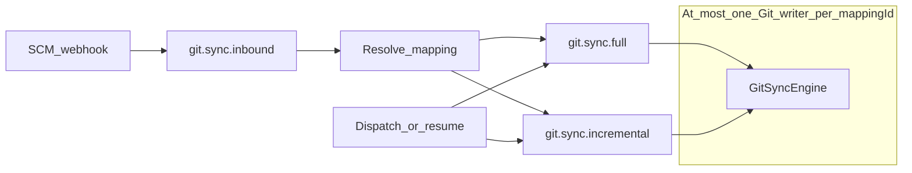
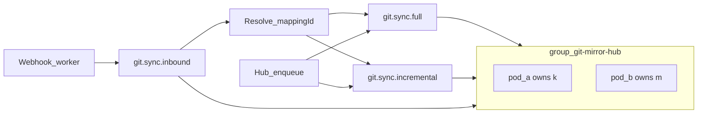
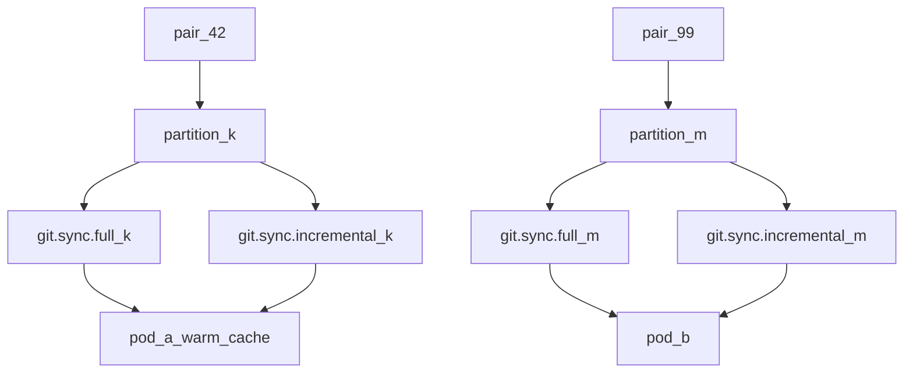

# Kafka partitions & consumer groups for GitMirror Hub mirroring

> **Status:** Authoritative design (backlog). Not a live broker cutover.  
> **Folder:** [`future-work/`](README.md)  
> **Live system today:** RabbitMQ competing consumers + DB `pair_leases`. Product scale, UI Sync Repo, and “one job / one pod” live in [`ARCHITECTURE.md`](../ARCHITECTURE.md) **§3.6.1**. This file is only a **future broker** sketch.

This document is the **chosen Kafka shape** for GitMirror Hub’s mirroring pipeline (`SyncJob` / `RepoMapping`, webhook ingest, full vs incremental Git, pair exclusivity, bare-repo cache). Alternatives appear only at the end as rejected options.

It is **not** a plan to replace RabbitMQ in this branch. If Kafka is ever adopted, implement **this** design unless a later ADR supersedes it.

---

## Decision summary (top choice)

| Decision | Choice |
| :--- | :--- |
| Consumer groups | **One** fleet group: `git-mirror-hub` on every Hub pod |
| Execution topology | **Two** topics: `git.sync.full` + `git.sync.incremental`, same partition count **P = 32** |
| Record key (execution) | **`mappingId`** (string) |
| Record key (inbound) | Canonical **source repo URL** |
| Inbound topic | `git.sync.inbound` with **P = 64** |
| Co-location of same pair | **Co-partition** full + incremental; custom **co-partitioning assignor** so partition `k` of both topics stays on the same member |
| Per-pod concurrency | One Kafka listener thread **per assigned partition**; Git still capped by `GIT_THROTTLE_MAX_CONCURRENT_PUSHES` |
| Pair exclusivity | Keep **`pair_leases`** + in-JVM `repoLocks` (mandatory) |
| Offset commit | **After** Git success, skip/cancel, **or** a Git-subsumed skip — then lease release if held |
| Lease busy / stale Git work | **Never pause the partition.** Commit and either **skip** (Git subsumed) or **re-produce same key** so other pairs on this shard keep draining |
| Failures | Bounded in-place retries → topic-specific **DLT**; redrive with **same key** |
| Edge ingest | Worker publishes directly to **`git.sync.inbound`** (Kafka HTTP / Confluent REST), Hub never on webhook hot path |
| Operator pause / CB | Pause all group listeners fleet-wide via `cluster_runtime` |
| Observability | Lag per `topic`+`partition` + existing `workerInstanceId` / Internals heartbeats |

**Hard rejects:** one group per pod; key by `jobId`; single unkeyed execution topic; drop leases; `P = 1` on execution topics; **pause a partition because one pair’s lease is busy**.

---

## 1. Mirroring problem (what this design serves)

GitMirror Hub is a **mirror relay**. Source of truth remains GitHub / GHES / other SCMs. A Hub pod:

1. Accepts work (UI dispatch, resume, or an inbound webhook).
2. Runs [`GitSyncEngine.executeSync`](../backend/src/main/java/com/gitutility/service/GitSyncEngine.java) against a local/NAS bare repo `pair-{mappingId}.git`.
3. Optionally runs LFS and, on **full-mirror** jobs only, PR/release metadata ([`SyncLaneRouter.includePairMetadata`](../backend/src/main/java/com/gitutility/service/SyncLaneRouter.java)).

**Correctness:** at most one Git writer per `mappingId` (object DB, dest remotes, push ledgers). Today: `repoLocks` + [`PairLeaseService`](../backend/src/main/java/com/gitutility/service/PairLeaseService.java).

**Parallelism:** many pairs at once; full on pair A may overlap incremental on pair B.

**Cache:** prefer the pod that already has `pair-N.git` ([`cache-resume-worker-affinity.md`](cache-resume-worker-affinity.md)). Affinity is hit-rate, not truth.

**Ingest:** Cloudflare [`webhook-worker`](../webhook-worker/README.md) must stay off the Hub timeout path. Buffer first, then mirror.

---

## 2. Chosen Kafka topology

### 2.1 Topics and keys

| Topic | Purpose | Key | Partitions |
| :--- | :--- | :--- | :--- |
| `git.sync.inbound` | Edge webhook buffer + mapping resolve | Canonical source repo URL | **64** |
| `git.sync.full` | Full clone / `*` / metadata-capable jobs | `mappingId` | **32** |
| `git.sync.incremental` | Webhook branch / Sync main / overwrite | `mappingId` | **32** (same as full) |
| `git.sync.inbound.dlt` | Poison inbound | Same as source | 64 |
| `git.sync.full.dlt` | Poison full jobs | `mappingId` | 32 |
| `git.sync.incremental.dlt` | Poison incremental jobs | `mappingId` | 32 |

Scale rule: if the fleet grows past ~16 Hub pods, raise execution `P` in lockstep on **both** full and incremental (always equal). Default **32** is the design baseline.

### 2.2 Consumer group

- **`group.id` = `git-mirror-hub`** on every Hub replica.
- Every pod subscribes to **inbound + full + incremental** (and pauses the same set when operators pause).
- Assignment of execution partitions uses a **co-partitioning assignor**: member M that owns `git.sync.full` partition `k` also owns `git.sync.incremental` partition `k`.

Default murmur2 / sticky hashing of `mappingId` already places the same pair on the same index `k` of both topics; the assignor makes that index live on **one** pod.

### 2.3 Concurrency model

- Spring Kafka concurrency on a pod = **number of partitions assigned to that pod** for that listener container (one thread per partition).
- That is prefetch-1 **per shard**, not one Git job for the whole JVM.
- Git push concurrency remains gated by `GIT_THROTTLE_MAX_CONCURRENT_PUSHES` and existing LFS/PR pools so SCM 429s do not track Kafka fan-out.
- In-job ref/LFS fan-out stays orthogonal ([`fanout-concurrency.md`](fanout-concurrency.md)).

---

## 3. Authoritative event flows

### 3.1 Full-mirror (`git.sync.full`)

1. Persist `SyncJob`; produce with key `String.valueOf(mappingId)`.
2. Owner of partition `k = hash(mappingId) % 32` polls the record.
3. Apply **§5.1** (subsumption / stale / lease). A full is never skipped because incrementals ran.
4. If running Git: acquire `pair_leases`; take `repoLocks`; `GitSyncEngine.executeSync`.
5. Success, skip, cancel, or busy re-produce: **commit offset** (lease held only during Git).
6. Retryable SCM failure: do not commit; retry in place; after max attempts → DLT with same key, then commit source offset.

### 3.2 Incremental (`git.sync.incremental`)

Same as 3.1 on the incremental topic (Git + LFS only). If a full holds the lease for this mapping, **skip-commit** (`SUBSUMED_BY_FULL`) — do not pause this partition (other pairs’ webhooks on shard `k` must continue).

### 3.3 Inbound (`git.sync.inbound`)

1. Worker publishes envelope keyed by canonical **repo URL**.
2. Hub inbound consumer resolves `mappingId` or routes to unmapped inspector (no execution produce).
3. Produce **exactly one** record to full or incremental per [`SyncLaneRouter`](../backend/src/main/java/com/gitutility/service/SyncLaneRouter.java) (`*` / blank ref → full).
4. Commit **inbound** offset after that produce (ingest ACK ≠ Git ACK).

---

## 4. Parallelism contracts

| Axis | Design rule |
| :--- | :--- |
| Distinct pairs | Parallel across partitions / pods |
| Full vs incremental for **different** pairs | Parallel (two topics) |
| Same `mappingId` | **Never** two concurrent Git writers |
| Inside one job (refs / LFS) | Not Kafka; see fan-out plan |
| Webhook ingest | Parallel on inbound P=64; Git still gated by execution partitions |

Max in-flight Git work ≈ `min(32, replicas × assigned_partitions_per_pod)` then clipped by the push throttle.

---

## 5. Git-aware contention (normative) — do not pause partitions

A partition is a **multiplex of many `mappingId`s**. Kafka cannot commit offset N+1 while leaving N uncommitted. Pausing or blocking on offset N therefore stalls **every other pair** that hashed to the same shard — unacceptable for a mirror fleet.

Same pair’s events are **not** spread across random partitions: execution key is `mappingId`, so they share one partition **per topic**. The “other partition” case that matters for Git is the **sibling topic**: a full-mirror holding the lease on `git.sync.full` partition `k` while incrementals sit on `git.sync.incremental` partition `k` (same pod, second listener). Later webhooks can also sit **behind** the blocked offset on the incremental topic.

Git mirroring is **state-based**, not “every webhook must run in order”:

- DAG fast-path already skip-ACKs when `afterSha` is merged into the dest tip ([`GitSyncEngine`](../backend/src/main/java/com/gitutility/service/GitSyncEngine.java) `RevWalk.isMergedInto`).
- A **full** (`*`) job fetches/pushes the whole pair; pending incrementals for that mapping are usually redundant once that full succeeds or is in-flight.
- A **newer** incremental for the **same ref** supersedes older SHAs for that branch. Produce order is time order, so skipping a busy older record and running a later one is the right Git outcome.

### 5.1 Consume-time decision (top choice)

On every execution record, **before** Git:

1. **Subsumed by full** — incremental whose `mappingId` already has a **FULL** lease or `IN_PROGRESS`/`QUEUED` full-mirror job: mark job `SKIPPED` (`SUBSUMED_BY_FULL`), **commit**, do not Git. The full job covers those refs.
2. **Superseded SHA** — same `mappingId` + same ref already has a newer job (`afterSha` different and later job id / later enqueue) `QUEUED`/`IN_PROGRESS`/`SUCCESS` whose commit is a descendant, **or** dest tip already contains this SHA (existing fast-path): mark `SKIPPED` (`STALE_SUPERSEDED` / fast-path), **commit**.
3. **Lease busy, cannot subsume** — same pair, work still required (e.g. incremental for **another branch** while an incremental for `main` holds the lease; or full waiting on an incremental): **do not pause**. Mark job `QUEUED`, **commit this offset**, **re-produce the same payload to the same topic with the same key** (optional short delay header). Partition continues with the next record (other pairs). The deferred event lands at the tail of that key’s log and runs after current Git + any newer events already queued — then 5.1.1–2 or fast-path drop it if Git caught up.
4. **Lease free** — acquire lease, run Git, release, commit.

**Never skip a FULL because incrementals ran** (on this topic or the sibling). Incrementals do not replace a pair-wide clone / PR-metadata job.

**Never compact** execution topics by `mappingId` (last event might be `feature/x` and would erase a pending `main` webhook).

```mermaid
flowchart TD
  rec[Poll_execution_record]
  rec --> fullHold{Incremental_and_full_lease_or_full_job?}
  fullHold -->|yes| skipFull[SKIP_SUBSUMED_BY_FULL_commit]
  fullHold -->|no| stale{SHA_or_same_ref_already_superseded?}
  stale -->|yes| skipStale[SKIP_STALE_or_fastpath_commit]
  stale -->|no| busy{pair_lease_busy?}
  busy -->|yes| retryTail[Commit_and_reproduce_same_key]
  busy -->|no| git[Acquire_lease_GitSyncEngine]
  git --> done[Release_lease_commit]
```

### 5.2 Why tail re-produce is correct here (Git, not a generic queue)

For a strict FIFO workflow, re-producing to the tail can jump behind later keys and reorder vs already-queued records for that pair. For **this** mirror:

- Records for one pair already share a key; a tail retry is just “run this mapping again after whatever is already in the log.”
- Whatever is already in the log is **newer SCM truth** (later webhooks, or a full). Running Git against current remotes + DAG fast-path is the product behavior, not replaying every historical push event.
- Unblocking the partition lets **other mappingIds on shard `k`** keep mirroring — the pause approach would freeze them for the entire lease TTL (90s) or the whole full-clone.

### 5.3 Cross-topic (full vs incremental)

Co-partitioning puts both listeners on one pod, but they are **two pollers**. If full holds the lease, the incremental poller hits 5.1.1 and **skip-commits** — it must **not** pause `git.sync.incremental` (that would stall every other pair’s webhooks on `k`).

If incremental holds the lease and a full record arrives on the sibling topic: full **waits via 5.1.3** (re-produce same key on `git.sync.full`), because a full is not subsumed by a branch job. After the incremental finishes, the full runs and then any further incrementals fast-path or skip.

### 5.4 Commit rule

Commit after: Git success / skip / cancel / **subsumed skip** / **busy re-produce**. Hold the lease only while actually inside `executeSync`.

---

## 6. Rebalance, crash, resume (normative)

| Event | Behavior |
| :--- | :--- |
| Pod join/leave | Co-partitioning reassign; new owner continues from **committed** offset |
| Kill -9 mid-push | Offset uncommitted → replay; resume via fetch seal / `completed_push_refs` / `INTERRUPTED` + operator resume |
| Stale lease | TTL (default 90s) or delete `pair_leases` for that `mappingId` |
| Startup | Consumers **paused** until Queue Manager resume (same as today) |

Kafka chooses **which pod** sees partition `k`. Resume ledgers still choose **how far** Git has progressed.

---

## 7. Failure, pause, observability (normative)

| Concern | Choice |
| :--- | :--- |
| Poison record | Topic DLT after bounded retries; commit source offset |
| Redrive | Produce back onto original topic **with the same key** |
| Fleet pause / CB OPEN | Pause Kafka listeners on every pod (`cluster_runtime`) |
| Queue UI | Lag (`end − committed`) per topic/partition + `workerInstanceId` |
| Metrics | Low-cardinality lag gauges; **no** `mappingId` Micrometer tags |

---

## 8. Edge worker (normative)

**Chosen:** Worker publishes to **`git.sync.inbound`** via Kafka-compatible HTTP (or a thin edge producer), key = repo URL, then returns `202` to SCM.

Hub availability must not sit on the GitHub webhook timeout path.

---

## 9. Rejected alternatives (kept for context)

| Alternative | Why not the top choice |
| :--- | :--- |
| One consumer group per pod | Every pod replays every job |
| Single merged execution topic | Serializes unrelated full vs incremental work that shares a partition |
| Key by `jobId` | Splits one pair across partitions; races Git |
| Drop `pair_leases`; trust partitions only | Unsafe across rebalance and topic skew |
| Range assignor alone without co-partition guarantee | Fragile if subscription sets or `P` diverge |
| **Pause partition on lease busy** | Head-of-line blocks **unrelated pairs** on the same shard; freezes incrementals for every mapping hashing to `k` while one full-clone runs |
| Compact execution topics by `mappingId` | Last event is one ref; would drop other branches’ pending webhooks |
| Skip a FULL because incrementals already ran | Full is pair-wide (all refs + optional PR/release metadata) |
| Worker → only Hub HTTP, Hub produces to Kafka | Puts Hub on the webhook hot path |
| Rabbit dual-write + Kafka | Out of scope for this design; complexity without a clear cutover story |
| `P = 1` execution | Serializes the fleet |

These may be revisited only via a new ADR that explicitly supersedes this document.

---

## 10. Non-goals

- Shipping Kafka in the current multi-pod Rabbit branch.
- Rewriting [`ARCHITECTURE.md`](../ARCHITECTURE.md) as if Kafka is production.
- Dual-write or runtime broker switch in this design.
- Using Kafka as the Git object store.

---

## 11. Implementation touchpoints (when prioritized)

- Produce path: [`QueueProducerService`](../backend/src/main/java/com/gitutility/service/QueueProducerService.java), [`SyncLaneRouter`](../backend/src/main/java/com/gitutility/service/SyncLaneRouter.java)
- Consume path: [`QueueConsumerService`](../backend/src/main/java/com/gitutility/service/QueueConsumerService.java), [`InboundWebhookConsumerService`](../backend/src/main/java/com/gitutility/service/InboundWebhookConsumerService.java)
- Safety: [`PairLeaseService`](../backend/src/main/java/com/gitutility/service/PairLeaseService.java), [`GitSyncEngine`](../backend/src/main/java/com/gitutility/service/GitSyncEngine.java)
- Ops UI: Queue Manager lag; Internals unchanged process metrics
- Edge: `webhook-worker` publish target

**Sequencing:** pair-lease + resume correctness (affinity Phase 0) → this topic/key/group/co-partition design → Spring Kafka listeners → edge worker last.
