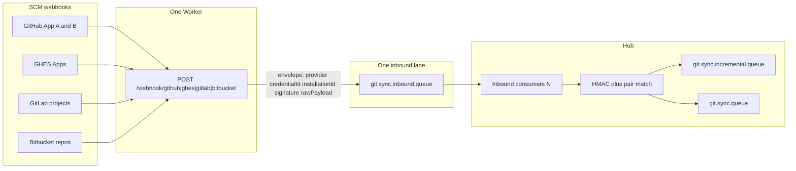

# Future plan: Multi-config webhook ingest topology

> **Status:** Deferred / backlog  
> **Folder:** [`future-work/`](README.md)  
> **Depends on:** Multi GitHub/GHES `scm_credentials` (**shipped**). Auth on consume is a **separate** parked slice: [`scm-credential-vault-and-hub-hmac.md`](scm-credential-vault-and-hub-hmac.md) (Hub HMAC; Worker as dumb publisher).  
> **Non-goal:** Implement now. Do not add Kafka, extra Cloudflare Workers, or a queue per credential/org.

Scaling across many GitHub Apps, GHES appliances, GitLab projects, and Bitbucket repos is an **identity-on-the-envelope** problem, not a “one Worker / one queue / one Kafka topic per config” problem.

Cloudflare already horizontally scales **one** Worker. RabbitMQ already buffers **one** inbound lane. Hub already splits **execution** (incremental vs full) behind a per-pair lock. The missing piece is **which credential/secret this delivery belongs to**.

## What stays one (default)

- **One Worker** — path multiplex only (`/webhook/github`, `/webhook/ghes`, `/webhook/gitlab`, `/webhook/bitbucket`). Extra Workers only for blast-radius isolation (separate Cloudflare account / region), not per org.
- **One inbound queue** — `git.sync.inbound.queue` (routing key `git.webhook.inbound`). Identity lives on the envelope, not in routing keys.
- **RabbitMQ, not Kafka** — replacing or duplicating the broker does not solve HMAC routing or pair matching. Kafka would be a second system with the same “put identity on the record” problem.
- **Existing execution split** — webhook work already goes to `git.sync.incremental.queue`; full mirrors to `git.sync.queue`. Same pair still serializes on `repoLocks`. Throughput of **mirrors** is Hub pods + later shard affinity ([`cache-resume-worker-affinity.md`](cache-resume-worker-affinity.md)), not more ingest topics.

## Envelope identity (when ingest work is scheduled)

Carry enough for Hub to fail-close without a secret map on the Worker:

| Field | Why |
| :--- | :--- |
| `provider` | `github` / `ghes` / `gitlab` / `bitbucket` (already on [`InboundWebhookEnvelope`](../webhook-worker/src/index.ts)) |
| `credentialId` | Optional path `/webhook/github/credential/{id}` or resolved after HMAC |
| `installationId` | GitHub App payload `installation.id` → `scm_credentials.installationId` |
| `signature` | `X-Hub-Signature-256` (or GitLab/Bitbucket equivalent) — Hub verifies |
| `rawPayload` | Bytes HMAC is computed over |
| `deliveryId` / `eventType` | Dedup and event routing (already present) |

`mappingId` on the envelope stays optional (legacy `/webhook/github/{mappingId}`). Prefer credential/installation + pair bind (`sourceCredentialId` / `targetCredentialId`).

Auth **how** (Worker dumb publisher vs edge `WEBHOOK_SECRETS_JSON`) is specified in [`scm-credential-vault-and-hub-hmac.md`](scm-credential-vault-and-hub-hmac.md) item 2. This doc does not pick HMAC mechanics; it forbids multiplying topology to work around missing identity.

## How many webhook URLs each SCM actually needs

- **One GitHub App, many orgs/installs:** one App webhook URL. GitHub sends `installation.id`. Hub maps that to the `scm_credentials` row and to pairs bound to that card. Per-card `/credential/{id}` URLs are optional HMAC-routing, not required App config.
- **Several GitHub Apps (different App IDs / secrets):** still **one** Worker URL if Hub verifies HMAC on consume. The Worker cannot pick the right secret for a shared URL. Edge `WEBHOOK_SECRETS_JSON` does not scale (redeploy per new card).
- **GitLab / Bitbucket:** many project webhooks can all POST to the same `/webhook/gitlab` or `/webhook/bitbucket`. Match pair by clone URL (today). Per-credential GitLab/Bitbucket rows are a later pass; do not invent topics for them now.

Settings UI should keep showing **App-level** Edge + Hub-direct URLs, not one URL per installation card.

## Scale order (only when measured)

1. **Inbound consumer count** on the same queue (prefetch stays 1) if match/dedup/HMAC is the bottleneck.
2. **More Hub pods** for JGit execution; pair lock / later DB lease keeps one pair on one worker.
3. **Optional** second inbound queue **by provider** (e.g. GitLab flood vs GitHub SLA) — still not per credential.
4. **Never** a queue or Worker per `scm_credentials` row.

## Exit criteria (when scheduled)

- Adding a GitHub App / GHES appliance / GitLab project does **not** require a new Worker, queue, or Kafka topic.
- Inbound envelope can identify provider + credential or installation so Hub can HMAC and bind a pair fail-closed.
- Settings still expose one App-level webhook URL (Edge + Hub-direct fallback).
- Docs in `ARCHITECTURE.md` §4/§5 updated only when this ships.

## Non-goals

- Kafka (or any second broker) as the inbound path
- A Cloudflare Worker or AMQP queue per org, App, or `scm_credentials` row
- Implementing Hub HMAC or Worker dumb-publisher here (see the HMAC doc)
- GitLab/Bitbucket `scm_credentials` (god-row stays until that pass)
- Changing `git.sync.incremental.queue` / `git.sync.queue` bindings

## Touchpoints (when scheduled)

[`webhook-worker/src/index.ts`](../webhook-worker/src/index.ts), [`InboundWebhookMessage`](../backend/src/main/java/com/gitutility/model/dto/InboundWebhookMessage.java), [`InboundWebhookConsumerService`](../backend/src/main/java/com/gitutility/service/InboundWebhookConsumerService.java), [`WebhookIngestionService.processInboundMessage`](../backend/src/main/java/com/gitutility/service/WebhookIngestionService.java), [`WebhookController`](../backend/src/main/java/com/gitutility/controller/WebhookController.java), Settings webhook URL copy ([`frontend/src/utils/webhookUrls.ts`](../frontend/src/utils/webhookUrls.ts)).
