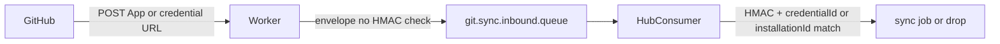

# Future plan: Vault refs & Hub HMAC on consume

> **Status:** Deferred / backlog  
> **Folder:** [`future-work/`](README.md)  
> **Depends on:** Multi GitHub/GHES `scm_credentials` (**shipped:** picker bind, per-credential webhook URLs, fail-closed mismatch). Both numbered items below are **pending**.  
> **Non-goal:** Implement now; do not bake App PEM/PAT/webhook secrets into deploy YAML as the primary operator path.

Two related items. They can ship independently. HMAC at the edge is item 2, not a side effect of Vault.

## 1. Vault refs, not deploy configs

Today Hub encrypts secret bytes in Postgres (`EncryptedStringConverter` + `GIT_UTILITY_ENCRYPTION_KEY`). The DB still *holds* ciphertext.

**Do:** Keep credential *identity* in `scm_credentials` (`id`, label, provider, hostUrl, authMode, appId, installationId, accountLogin, pair `sourceCredentialId` / `targetCredentialId`, webhook path). Move only secret bytes (`privateKeyPem`, `patToken`, `webhookSecret`, `clientSecret`) to a vault. Persist `vaultRef` (+ version). Settings UI still pastes PEM/PAT; Hub is the Vault client.

**Do not:** Make GitHub/GHES App/PAT/webhook secrets deploy-time YAML / env lists. That freezes add-org, rotate, and rebind behind a redeploy. Deploy-time stays for platform secrets (`GIT_UTILITY_ENCRYPTION_KEY`, AMQP, DB). Optional later: GitOps writes the same Vault paths; deploy injects `VAULT_ADDR` + IAM only.

**Size:** Medium (about 1–2 engineer-weeks for one vault vendor, GitHub/GHES rows only). God-row GitLab/Bitbucket/Origin and pair `tokenA`/`tokenB` are a second pass. Picker, pair bind, and `AUTH_INSTALLATION_MISMATCH` do not need a rewrite.

**Touchpoints:** [`ScmCredential`](../backend/src/main/java/com/gitutility/model/entity/ScmCredential.java), [`ScmCredentialService`](../backend/src/main/java/com/gitutility/service/ScmCredentialService.java), new `SecretStore` SPI, schema migrator.

## 2. Hub HMAC on consume (preferred) — queue stays; Worker is a dumb publisher

**Distinct from ingest topology:** HMAC (this item) is *how* Hub trusts a delivery. *How many* Workers/queues you run as configs multiply is [`multi-config-webhook-ingest.md`](multi-config-webhook-ingest.md) — default remains one Worker and `git.sync.inbound.queue`; do not add Kafka or a queue per credential to paper over missing envelope identity.

Today: GitHub → Worker (optional HMAC via `WEBHOOK_SECRET` / `WEBHOOK_SECRETS_JSON`) → `git.sync.inbound.queue` → Hub. Hub inbound consumer **does not re-check** `message.signature` ([`WebhookIngestionService.processInboundMessage`](../backend/src/main/java/com/gitutility/service/WebhookIngestionService.java)). Direct Hub HTTP routes HMAC; the Worker path trusts the edge. Credential-URL ingest drops `credentialId` on the envelope (`mappingId: null`), so Hub matches by repo URL only.

**Preferred:** Keep the queue. Worker publishes only (no GitHub HMAC, no secret map). Envelope carries `credentialId` + raw payload + `X-Hub-Signature-256`. Hub consumer fail-closes: HMAC against the DB (later Vault) credential, then pair bound to that id. Invalid HMAC → drop, no sync job. Settings/Vault stay one source of truth.

**Tradeoff:** Anyone who can POST to the Worker URL can enqueue bytes until Hub drops them. Later mitigations (not required to start): WAF, shared ingest token (not the GitHub HMAC), rate limits.

**Touchpoints:** [`webhook-worker/src/index.ts`](../webhook-worker/src/index.ts) (`InboundWebhookEnvelope` + `credentialId`), [`InboundWebhookMessage`](../backend/src/main/java/com/gitutility/model/dto/InboundWebhookMessage.java), [`InboundWebhookConsumerService`](../backend/src/main/java/com/gitutility/service/InboundWebhookConsumerService.java), [`WebhookIngestionService.processInboundMessage`](../backend/src/main/java/com/gitutility/service/WebhookIngestionService.java), [`ScmCredentialService.hmacMatches`](../backend/src/main/java/com/gitutility/service/ScmCredentialService.java).

### Alternates (not preferred)

| Option | What | Cost |
| :--- | :--- | :--- |
| Ops-sync Worker map | Keep HMAC on the Worker with `WEBHOOK_SECRETS_JSON` | Rotate/add a card = `wrangler secret put`; Hub and edge stay duplicated |
| Worker fetches secret on the hot path | Worker calls Hub or Vault per POST for the HMAC key | Avoids a stale map; adds latency, auth, and a Hub/Vault dependency that undermines isolated edge ingest |
| Hub-only webhooks (no Worker) | Point GitHub at Hub `/api/v1/webhooks/github/credential/{id}` | Simplest HMAC (already implemented). Lose edge 0ms ingest and AMQP buffering at the Cloudflare door |

Pick one when this item is scheduled; default is Hub-on-consume.

## Exit criteria (when scheduled)

- Item 1: Settings create/rotate still works; Postgres has no PEM/PAT/webhook ciphertext for `scm_credentials`; sync mints from Vault; Vault outage fails jobs closed (`VAULT_UNAVAILABLE`).
- Item 2: Worker has no GitHub HMAC secret map; inbound consumer rejects bad signatures; forged payload for a mapped repo without a valid credential HMAC never starts a sync job.

## Non-goals

- Shipping Vault or changing ingest in the current credential-list work
- Teaching the Worker to use Vault as a prerequisite for item 1
- Replacing RabbitMQ inbound buffering (topology scale: [`multi-config-webhook-ingest.md`](multi-config-webhook-ingest.md))
